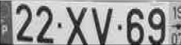

# Introdução

Uma empresa de tecnologia procura o desenvolvimento de um algoritmo que faça a deteção de matrículas de veículos e extraia os seus caracteres, especificamente, de matrículas portuguesas, para gestão de entradas e saídas das instalações da empresa.
O algoritmo deve ser constituído por quatro módulos:
-	**Deteção da matrícula**: módulo responsável pela deteção das matrículas. Neste módulo serão recolhidas imagens de veículos com matrícula portuguesa, com as quais será criado um dataset utilizado para treinar um modelo de deep learning. Depois do treino, os pesos (um ficheiro do tipo .pt, por exemplo, “best.pt”), gerados durante o treino, serão utilizados para efetuar inferências sobre imagens nunca antes vistas. Por fim, guardar as imagens com as anotações feitas durante as inferências e os respetivos ficheiros (do tipo .txt) que contêm as coordenadas das bounding boxes, de forma a ser utilizado no próximo módulo. 
-	**Recorte da imagem com base nas coordenadas da bounding box**: módulo responsável por pelo recorte da área onde foi detetada a matrícula. Com os valores presentes em cada ficheiro, calcular as coordenadas do canto superior esquerdo e o canto inferior direito da bouding box. Por fim, utilizar uma biblioteca que permita processar digitalmente imagens (OpenCV) para efetuar o recorte da área da bounding box e guardar as novas imagens que apenas contêm a matrícula.
-	 **Pipeline de processamento digital de imagem**: módulo responsável por extrair os caracteres presentes nas imagens recortadas, obtidas no módulo anterior. De forma a atingir este objetivo existem várias abordagens que podem ser utilizadas:
o	OCR (Optical Character Recognition) - processo que converte imagens com texto em texto capaz de ser compreendido por computadores.
o	Pipeline de processamento digital de imagem - segmentação e extração dos caracteres utilizando técnicas de processamento de imagem.
-	**Análise de texto e correção de erros**: módulo responsável pela análise do texto extraído, de todas as imagens, e correção de potenciais erros cometidos pela abordagem utilizado no módulo anterior.

Diagrama de funcionamento do algoritmo:


# Conteúdo

- [Recursos](#software-a-utilizar)
- [Módulo 1 - Deteção da matrícula](#módulo-1---deteção-da-matrícula)
  - [Construção do dataset](#construção-do-dataset)
  - [Preparação do dataset (Roboflow)](#preparação-do-dataset-(roboflow))
    - [Criar projeto de deteção de objetos](#criar-projeto-de-deteção-de-objetos)
    - [Efetuar upload das imagens recolhidas](#efetuar-upload-das-imagens-recolhidas)
    - [Anotar as imagens](#anotar-as-imagens)
    - [Aplicar aumentações (opcional)](#aplicar-aumentações-(opcional))
    - [Efetuar download do dataset no formato desejado](#efetuar-download-do-dataset-no-formato-desejado)
  - [Acesso ao Google Drive](#acesso-ao-google-drive)
  - [Treino do dataset](#treino-do-dataset)
    - [Resultados do treino](#resultados-do-treino)
  - [Inferir sobre novas imagens](#inferir-sobre-novas-imagens)
- [Módulo 2 - Recorte da imagem com base nas coordenadas da bounding boxes](#módulo-2---Recorte-da-imagem-com-base-nas-coordenadas-da-bounding-boxes)
  - [Organização dos ficheiros com as bounding boxes](#organização-dos-ficheiros-com-as-bounding-boxes)
  - [Bibliotecas a utilizar](#bibliotecas-a-utilizar)
  - [Abrir os ficheiros e ler os seus conteúdos](#abrir-os-ficheiros-e-ler-os-seus-conteúdos)
    - [Reverter a normalização das coordenadas geradas](#reverter-a-normalização-das-coordenadas-geradas)
  - [Calcular as coordenadas dos ponto superior esquerdo e do ponto inferior direito](#calcular-as-coordenadas-dos-ponto-superior-esquerdo-e-do-ponto-inferior-direito)
  - [Efetuar o recorte da imagem com base nas coordenadas calculadas](#efetuar-o-recorte-da-imagem-com-base-nas-coordenadas-calculadas)
  -[Recorte da imagem (código completo)](#recorte-da-imagem-(código-completo))
- [Módulo 3 - Pipeline de processamento digital da imagem](#módulo-3---pipeline-de-processamento-digital-da-imagem)
  - [Pré-processamento das imagens recortadas](#pré---processamento-das-imagens-recortadas)
  - [Abordagem 1 - Utilização de uma biblioteca OCR (Optical Character recognition)](#abordagem-1---Utilização-de-uma-biblioteca-OCR-(Optical-Character-recognition))
    - [Instalar a biblioteca PaddleOCR](#instalar-a-biblioteca-PaddleOCR)
    - [Carregar o modelo responsável pelo reconhecimento de texto](#carregar-o-modelo-responsável-pelo-reconhecimento-de-texto)
    - [Aplicar o OCR sobre as imagens](#aplicar-o-OCR-sobre-as-imagens)
    - [Guardar os resultados](#guardar-os-resultados)
  - [Abordagem 2 - Aplicação do método de Otsu](#abordagem-2---aplicação-do-método-de-otsu)
    - [Pré-processamento das imagens](#pré-processamento-das-imagens)
    - [Aplicar o algoritmo de Otsu](#aplicar-o-algoritmo-de-Otsu)
    - [Verificar o número de píxeis pretos](#verificar-o-número-de-píxeis-pretos)
    - [Calcular contours da imagem binarizada](#calcular-contours-da-imagem-binarizada)
    - [Com base nos contours extrair os caracteres](#com-base-nos-contours-extrair-os-caracteres)
    - [Classificar os caracteres extraídos](#classificar-os-caracteres-extraídos)
  - [Abordagem 3 - Utilização da biblioteca Grounding Dino (deteção de caracteres) e Segment Anything Model (segmentação de caracteres)](#abordagem-3---utilização-da-biblioteca-grounding-dino-(deteção-de-caracteres)-e-segment-anything-model-(segmentação-de-caracteres))
    - [Instalar bibliotecas Grounding Dino e Segment Anythin Model (SAM)](#instalar-bibliotecas-grounding-dino-e-segment-anythin-model-(SAM))
    - [Aplicar do Grounding Dino sobre as imagens](#aplicar-do-grounding-dino-sobre-as-imagens)
    - [Aplicar o SAM sobre as imagens geradas pelo Grounding Dino](#aplicar-o-sam-sobre-as-imagens-geradas-pelo-grounding-dino)
    - [Obter as máscaras geradas](#obter-as-máscaras-geradas)
    - [Inverter as cores das máscaras](#inverter-as-cores-das-máscaras)
    - [Calcular contours da imagem binarizada](#calcular-contours-da-imagem-binarizada)
    - [Com base nos contours extrair os caracteres](#com-base-nos-contours-extrair-os-caracteres)
    - [Classificar os caracteres extraídos](#classificar-os-caracteres-extraídos)
- [Módulo 4 - Análise de texto e correção de erros](#módulo-4---Análise-de-texto-e-correção-de-erros)
  - [Formato das matrículas portuguesas](#formato-das-matrículas-portuguesas)
  - [Erros nos resultados obtidos pelo OCR e classificação de caracteres](#erros-nos-resultados-obtidos-pelo-ocr-e-classificação-de-caracteres)
  - [Correção de erros](#correção-de-erros)
  - [Comparar resultados com as matrículas](#comparar-resultados-com-as-matrículas)


# Recursos

Para o desenvolvimento do protocolo serão utilizados os seguintes recursos:

- [Google Colab](https://colab.research.google.com/): desenvolvimento do código e treino dos modelos;
- [Google Drive](https://www.google.com/drive/): guardar os datasets e os resultados do treino;
- [Roboflow](https://roboflow.com/): preparar os dados para o dataset;
- [YOLO (You Only Look Once)](https://github.com/ultralytics): treinar um modelo utilizando o dataset desenvolvido e inferir sobre novas imagens;
- [Otsu](https://en.wikipedia.org/wiki/Otsu%27s_method): segmentar imagens (abordagem 2);
- [PaddleOCR](https://github.com/PaddlePaddle/PaddleOCR/blob/release/2.7/README_en.md): deteção automática de texto presente em imagens (abordagem 1);
- [Grounding Dino](https://github.com/IDEA-Research/GroundingDINO): deteção automática de objetos, com base num prompt (abordagem 3);
- [Segment Anything Model](https://github.com/facebookresearch/segment-anything): segmentação automática de objetos (abordagem 3).


# Módulo 1 - Deteção da matrícula

## Construção do dataset

O dataset deve ser constituído por imagens diurnas (tiradas manualmente, obtidas da Internet, vídeo, etc..) de veículos (carros, carrinhas, camiões, motas...) com matrícula portuguesa frontais e traseiras sem muita angulação (vertical ou horizontal) em que os caracteres das da matrícula sejam bem visíveis. A condição de iluminação das imagens também deve ser variada. Quantas mais imagens melhor, embora o tempo de anotação seja maior (sugestão: 200 a 500 imagens). 

<div align="center">

| **Imagens adequadas para o treino** | **Imagens não adequadas para o treino** | 
|:----:|:----:|
|||
|||
|||
|||


</div>

### Preparação do dataset (Roboflow)

Necessário ter uma conta Roboflow.

Colocar video

### Criar projeto de deteção de objetos

Colocar video

### Efetuar upload das imagens recolhidas

Colocar video

### Anotar as imagens

Colocar video

### Aplicar aumentações (opcional)

As aumentações são opcionais, uma vez que os resultados do treino podem ser os pretendidos mesmo sem as efetuar.
São úteis quando os dados são poucos.

Caso sejam necessárias, as seguintes são as mais pertinentes:

- Flip
- Crop
- Rotation
- Brightness
- Noise

Colocar video

### Efetuar download do dataset no formato desejado

Efetuar o download do dataset no formato do modelo a utilizar no treino e colocar no Google Drive.

Colocar Video

## Acesso ao Google Drive

```bash

from google.colab import drive

drive.mount('/content/drive/') # nome da diretoria onde serão colocados os ficheiros do Google Drive -> /nome_da_pasta/MyDrive/

# os conteúdos do Google Drive têm de estar numa diretoria vazia

```
## Treino do dataset

Instalação de bibliotecas:

```bash

# contém todos os scripts dos modelos, as bibliotecas nencessárias para o seu funcionamento
# o ponto de exclamação antes do comando indica que se pretende utilizar um comando da linha de comandos

# entrar na diretoria do YOLO
%cd /content/caminho/yolov5

!pip install -qr requirements.txt  # instala as dependências listadas no ficheiro (apenas as que ainda não estão instaladas)

```

Parâmetros a ter em conta:

- epochs -> número de iterações do treino
- batch -> o número de imagens utilizadas em cada iteração - este número deve ter em conta o tamanho da imagem e a memória de vídeo da placa gráfica
- img -> tamanho da imagem utilizado como input
- patience -> o número de “epochs” necessárias em que não existe melhoria da loss de validação para parar o treino automaticamente
- name -> o nome da diretoria onde são guardados os resultados do treino
- cfg -> modelo a utilizar, por exemplo, yolov5s.yaml, yolov5m.yaml, yolov5l.yaml, yolov5x.yaml (substituir o número 5 por 3 ou 8, tendo em conta a versão do modelo utilizada)
- weights -> utilizar um modelo pré-treinado ou YOLO (por exemplo, yolov5s.pt, yolov5m.pt, yolov5l.pt, yolov5x.pt - substituir o número 5 por 3 ou 8, tendo em conta a versão do modelo utilizada) ou personalizado (por exemplo, best.pt)


```bash

# exemplo de treino que utiliza o modelo yolov5l e os pesos pré-treinados do modelo yolov5l
!python train.py --img 256 --batch 24 --epochs 2 --data  /content/caminho/data.yaml --cfg ./models/yolov5l.yaml --weights yolov5l --name resultados  --cache --exist-ok

```

As métricas finais do treino são as da validação (melhores).

Exemplo de métricas:

Para efetuar de nova a validação:

```bash 

# para validar os resultados do treino é necessário utilizar o script val.py
# basta indicar o caminho para os pesos do treino e o tamanho de input das imagens

!python val.py --data /content/caminho/data.yaml --weights /content/caminho/best.pt--img 640 

# na consola encontram-se os resultados das métricas

# os resultados da validação são guardados na pasta runs/val

```

Para obter as métricas de teste:

```bash

# basta indicar o caminho para os pesos do treino, o tamanho de input das imagens e indicar --task test

!python val.py --data /content/caminho/data.yaml --weights /content/caminho/best.pt --img 640 

```

Exemplo de métricas de teste:

### Resultados do treino

Exemplo de resultados de um treino:

Colocar imagens do treino (metricas)

## Inferir sobre novas imagens

A confiança mínima utilizada deve ser de 0.65.
Utilizar o parâmetro "--save-txt" para guardar ficheiros com as coordenadas das bounding boxes detetadas. Caso não seja detetada nenhuma matrícula, o ficheiro não é gerado.

```bash

# para inferir é necessário utilizar o script detect.py
# basta indicar o caminho para os pesos do treino, o tamanho de input das imagens, a confiança mínima, caminho das imagens,
# o caminho onde são guardadas os resultados e indicar que se pretende guardar as coordenadas das bounding boxes -> --save-txt

!python detect.py --weights /content/drive/MyDrive/Exemplo_Codigo/weights/best.pt --img 512 --conf 0.65 --source /content/drive/MyDrive/Exemplo_Codigo/datasets/inferencias/exemplo_carros --name resultados --save-txt

# na consola encontram-se os resultados das métricas

# os resultados da inferência são guardados na pasta runs/detect, se apenas for indicado o nome da diretoria

```


# Módulo 2 - Recorte da imagem com base nas coordenadas da bounding boxes

## Organização do ficheiro com as bounding boxes

Cada ficheiro tem pelo menos uma linha de texto constituído por cinco valores:

- class -> classe do objeto detetado, não é relevante para o problema em questão;
- x_center -> valor de x, do centro da bounding box;
- y_center -> valor de y, do centro da bounding box;
- width -> largura da bounding box;
- height -> altura da bounding box.

<div align="center">


</div>


## Bibliotecas a utilizar

```bash

import cv2 # OpenCV, abrir e guardar imagens
import glob # obtém os caminhos todos os ficheiros presentes na diretoria dada, pastas inclusive

```

## Abrir os ficheiros e ler os seus conteúdos

```bash

# alterar pasta onde se encontram as labels, se necessário
diretoria_labels = "/content/caminho/labels/*" # caminho termina com *, indica todos os ficheiros presentes na diretoria

coordenadas = []

# sorted ordena alfabeticamente os nomes dos caminhos
for item in sorted(glob.iglob(diretoria_labels)):

  # executar as operações necessárias para a leitura dos ficheiros

  # abrir o ficheiro
  f = open(item)

  # ler todas as linhas do ficheiro
  linhas = f.readlines()

  for linha in linhas:

    # remover parágrafos
    l = linha.replace("\n", "")

    # obter cada valor
    temp = l.split(" ")

    cc = [float(temp[1]), float(temp[2]), float(temp[3]), float(temp[4])]

    coordenadas.append(cc)

    #break

  f.close()

```

### Reverter a normalização das coordenadas geradas

```bash

    # largura e altura da imagem aberta
    largura_imagem = imagem.shape[1]
    altura_imagem = imagem.shape[0]

    # calcular coordenadas
    # desnormalizar as coordenadas
    des_x = coordenadas[i][0] * largura_imagem
    des_y = coordenadas[i][1] * altura_imagem
    des_width = coordenadas[i][2] * largura_imagem
    des_height = coordenadas[i][3] * altura_imagem

```

## Calcular as coordenadas dos ponto superior esquerdo e do ponto inferior direito

```bash

    bb_thickeness = 4 # para remover a bounding box

    # cálculo do ponto superior esquerdo (xmin, ymax) e do ponto inferior direito (xmax, ymin)
    xmin = des_x - des_width + des_width / 2 + bb_thickeness 
    xmax = des_x + des_width - des_width / 2 - bb_thickeness
    ymin = des_y - des_height + des_height / 2 + bb_thickeness
    ymax = des_y + des_height - des_height / 2 - bb_thickeness

```

## Efetuar o recorte da imagem com base nas coordenadas calculadas

```bash

    # recorte da imagem
    imagem_crop = imagem[int(ymin) : int(ymax), int(xmin) : int(xmax)]

```

<div align="center">


</div>

## Recorte da imagem (código completo)

```bash

# alterar diretoria onde se encontram os resultados, se necessário
diretoria_imagens = "/content/drive/MyDrive/Exemplo_Codigo/yolov5/yolov5-master/runs/detect/resultados3/*" # caminho termina com *, indica todos os ficheiros presentes na diretoria

diretoria_guardar_imagens = "/content/drive/MyDrive/Exemplo_Codigo/imagens_recortadas/" # caminho onde as imagens recortadas serão guardadas

i = 0

# sorted ordena alfabeticamente os nomes dos caminhos
for item in sorted(glob.iglob(diretoria_imagens)):

  # executar as operações necessárias para a leitura dos ficheiros

  if not item.__contains__("labels"): # para não considerar a diretoria das labels

    # abrir a imagem
    imagem = cv2.imread(item)

    # largura e altura da imagem aberta
    largura_imagem = imagem.shape[1]
    altura_imagem = imagem.shape[0]

    # calcular coordenadas
    # desnormalizar as coordenadas
    des_x = coordenadas[i][0] * largura_imagem
    des_y = coordenadas[i][1] * altura_imagem
    des_width = coordenadas[i][2] * largura_imagem
    des_height = coordenadas[i][3] * altura_imagem

    bb_thickeness = 4 # para remover a bounding box

    # cálculo do ponto superior esquerdo (xmin, ymax) e do ponto inferior direito (xmax, ymin)
    xmin = des_x - des_width + des_width / 2 + bb_thickeness 
    xmax = des_x + des_width - des_width / 2 - bb_thickeness
    ymin = des_y - des_height + des_height / 2 + bb_thickeness
    ymax = des_y + des_height - des_height / 2 - bb_thickeness

    # recorte da imagem
    imagem_crop = imagem[int(ymin) : int(ymax), int(xmin) : int(xmax)]

    # guardar imagem
    cv2.imwrite("/content/drive/MyDrive/Exemplo_Codigo/imagens_recortadas/" + str(i) + ".png", imagem_crop)

  i = i + 1

```

# Módulo 3 - Pipeline de processamento digital da imagem

## Abordagem 1 - Utilização de uma biblioteca OCR (Optical Character recognition)

### Instalar a biblioteca PaddleOCR

```bash

# Instalar PaddleOCR
!pip install paddlepaddle-gpu
!pip install paddleocr
!wget http://archive.ubuntu.com/ubuntu/pool/main/o/openssl/libssl1.1_1.1.0g-2ubuntu4_amd64.deb
!sudo dpkg -i libssl1.1_1.1.0g-2ubuntu4_amd64.deb
!git clone https://github.com/PaddlePaddle/PaddleOCR

```

### Bibliotecas:

```bash

from paddleocr import PaddleOCR, draw_ocr # paddleOCR
from PIL import Image # abrir imagem
```

### Carregar o modelo responsável pelo reconhecimento de texto

```bash

# carregar o modelo
# apenas é necessário fazer uma vez por runtime
ocr = PaddleOCR(use_angle_cls = True, lang = 'en') # lang define a linguagem que o modelo deve reconhecer

```
  
### Aplicar o OCR sobre uma imagem


```bash

imagem = '/content/caminho/imagem'

resultado = ocr.ocr(imagem, cls = True)

```

### Resultados do OCR

O resultado do OCR é um array do qual é possível extrair:

- todas as deteções efetuadas;

```bash

  boxes = [line[0] for line in result] # coordenadas das bounding boxes
```

- o texto presente em cada bounding box;

```bash

  txts = [line[1][0] for line in result ] # texto detetado

```

- a confiança da classificação do texto;

```bash

  scores = [line[1][1] for line in result] # confiança das deteções
```

### Exemplo de um resultado da aplicação do OCR

<div>


</div>


### Aplicar o OCR e guardar os resultados (codigo completo)

```bash

imagens = '/content/drive/MyDrive/Exemplo_Codigo/imagens_recortadas/*'

resultados_path = "/content/caminho/resultados_ocr"

resultados_file = open(resultados_path, "a")

png = 0

for item in sorted(glob.iglob(imagens)):

  resultado = ocr.ocr(item, cls = True)

  # mostrar os resultados na imagem original

  result = resultado[0] 
  image = Image.open(item).convert('RGB')

  boxes = [line[0] for line in result] # coordenadas da bounding box
  txts = [line[1][0] for line in result ] # texto detetado
  scores = [line[1][1] for line in result] # confiança das deteções

  # adicionar resultado ao ficheiro dos resultados
  resultados_file.write(str(png) + " -> " + txts[0] + '\n')

  # para desenhar as boundings box na imagem original
  # im_show = draw_ocr(image, boxes, txts, scores, font_path='/content/PaddleOCR/StyleText/fonts/en_standard.ttf')
  # im_show = Image.fromarray(im_show)

  png = png + 1

resultados_file.close()

```


## Abordagem 2 - Aplicação do método de Otsu

### Pré-processamento das imagens

Abrir imagem e converter para preto e branco:

```bash

img = "/content/caminho/imagem"

imagem = cv2.imread(img, cv2.IMREAD_GRAYSCALE) # carregar imagem e converter a imagem para preto e branco

```

<div align="center">



</div>

Redimensionar imagem:

```bash

imagem_redimensionada = cv2.resize(imagem, (300, 75), interpolation=cv2.INTER_AREA) # redimensionar a imagem

```

<div align="center">


</div>

Máscara dos contours:

```bash

mask = np.zeros(imagem_redimensionada.shape, dtype=np.uint8) # criar uma máscara

```
<div align="center">


</div>

### Aplicar o algoritmo de Otsu

```bash

temp = imagem_redimensionada

thresh = cv2.threshold(temp, 0, 255, cv2.THRESH_BINARY_INV + cv2.THRESH_OTSU)[1] # aplicar o método

```
<div align="center">


</div>

### Verificar o número de píxeis pretos

O cálculo dos contours, próximo passo, apenas funciona se o fundo for preto e os caracteres brancos. 

```bash

w = imagem_redimensionada.shape[0] # largura da imagem
h = imagem_redimensionada.shape[1] # altura da imagem

non_zero = cv2.countNonZero(thresh) # obter o número de pixeis não pretos

if non_zero > (w * h) / 2:

  thresh = cv2.bitwise_not(temp) # inverter a cor dos pixeis

```


### Calcular contours da imagem binarizada

```bash

cnts = cv2.findContours(thresh, cv2.RETR_EXTERNAL, cv2.CHAIN_APPROX_SIMPLE) # encontrar contours
cnts = cnts[0] if len(cnts) == 2 else cnts[1]

(cnts, _) = contours.sort_contours(cnts, method="left-to-right") # ordenar os contours da esquerda para a direita

```

### Classificar os caracteres extraídos

### Bibliotecas

```bash

from tensorflow import keras
from tensorflow.keras import layers

```

```bash

input_shape = (50, 50, 1) # input que o modelo aceita
num_classes = 36 # número de classes
class_names = ['0', '1', '2', '3', '4', '5', '6', '7', '8', '9', 'A', 'B', 'C', 'D', 'E',
              'F', 'G', 'H', 'I', 'J', 'K', 'L', 'M', 'N', 'O', 'P', 'Q', 'R', 'S', 'T',
              'U', 'V', 'W', 'X', 'Y', 'Z'] # nomes das classes

# modelo de classificação
model = keras.Sequential(
    [
        layers.Dense(32, input_shape = input_shape),
        layers.Dense(64, activation = 'relu'),
        layers.Flatten(),
        layers.Dense(num_classes, activation = 'softmax'),
    ]
)

```

Carregar pesos pré-treinados:

```bash

# carregar os pesos
model.load_weights('/content/caminho/pesos')

```


### Extração e classificação dos caracteres

Cálculo da área de cada contour detetado:

```bash

    area = cv2.contourArea(c) # calcular a área do contour
    x, y, w, h = cv2.boundingRect(c) # obter os valores da bounding box (x (centro da bounding box), y (centro da bounding box), largura, altura)

```

Definir a condição que identifica caracteres:

```bash

if min_area < area < max_area and cx > lx + 10 and w < 50 and h > 20:

```

Recortar imagem:

```bash

char = 255 - imagens_thresh[counter][y: y + h, x: x + w] # a área a recortar

```

Redimensionar a imagem recortada para ser utilizada pelo classificado:

```bash

# redimensionar o caracter
char = cv2.resize(char, (50, 50), interpolation = cv2.INTER_AREA)
char = np.expand_dims(char, axis = 0)

```

Classificar imagem recortada:

```bash

# classificar caracter
prev =  model.predict(char)
output_class = class_names[np.argmax(prev)]

```

### Extração e classificação dos caracteres (código completo)

```bash

resultados_dir = "/content/caminho/resultados_otsu"

resultados_file = open(resultados_dir, "a")

png = 0

mask_cnt = 0

for cnts in imagens_cnts:

  resultados_file.write(str(png) + " -> ")

  resultado_classificacao = ""

  for c in cnts:

    area = cv2.contourArea(c) # calcular a área do contour
    x, y, w, h = cv2.boundingRect(c) # obter os valores da bounding box (x, y , largura, altura)

    counter = 0

    if min_area < area < max_area and cx > lx + 10 and w < 50 and h > 20:

        char = 255 - imagens_thresh[counter][y: y + h, x: x + w] # a área a recortar

        # redimensionar o caracter
        char = cv2.resize(char, (50, 50), interpolation = cv2.INTER_AREA)
        char = np.expand_dims(char, axis = 0)

        # classificar caracter
        prev =  model.predict(char)
        output_class = class_names[np.argmax(prev)]

        resultado_classificacao = resultado_classificacao + output_class

        mascaras[mask_cnt] = cv2.drawContours(mascaras[mask_cnt], [c], -1, (255, 255, 255), -1) # construir máscara

        lx = cx

        counter = counter + 1

  resultados_file.write(resultado_classificacao + "\n")

  png = png + 1

  mask_cnt = mask_cnt + 1

```


### Com base nos contours extrair os caracteres

Definir os valores mínimos e máximos da área dos contours:

```bash

min_area = 150 # área mínima dos contours
max_area = 2000 # área máxima dos contours

lx = 0 # último valor x
cx = 0 # atual valor x

```

### Com base nos contours extrair os caracteres

```bash

ROI_number = 0

for c in cnts:

    area = cv2.contourArea(c) # calcular a área do contour
    x, y, w, h = cv2.boundingRect(c) # obter os valores da bounding box (x (centro da bounding box), y (centro da bounding box), largura, altura)

    cx = x

    if min_area < area < max_area and cx > lx + 10 and w < 50 and h > 20:


        ROI = 255 - thresh[y: y + h, x: x + w] # a área a recortar

        cv2.drawContours(mask, [c], -1, (255, 255, 255), -1) # construir máscara

        #cv2.imwrite('/content/caminho/guardar_imagem' + str(ROI_number) + ".png", ROI) # guardar imagem recortada

        #ROI_number = ROI_number + 1

        lx = cx

```


Máscara gerada:

<div align="center">


</div>

Caracteres extraídos:

<div align="center">

     

</div>


## Abordagem 3 - Utilização da biblioteca Grounding Dino (deteção de caracteres) e Segment Anything Model (segmentação de caracteres)

### Instalar bibliotecas Grounding Dino e Segment Anythin Model (SAM)

Instalar repositórios do Grounding Dino e SAM

```bash

# Instalar repositório do Grounding Dino
!git clone https://github.com/IDEA-Research/GroundingDINO.git
%cd /content/GroundingDINO/
!pip install -e .

```

```bash

# Instalar repositórios SAM
!pip install git+https://github.com/facebookresearch/segment-anything.git

```

Bibliotecas:

```bash

import argparse
import os
import copy

import GroundingDINO.groundingdino.datasets.transforms as T
from GroundingDINO.groundingdino.models import build_model
from GroundingDINO.groundingdino.util import box_ops
from GroundingDINO.groundingdino.util.slconfig import SLConfig
from GroundingDINO.groundingdino.util.utils import clean_state_dict, get_phrases_from_posmap
from GroundingDINO.groundingdino.util.inference import annotate, load_image, predict

# Carregar modelos
from huggingface_hub import hf_hub_download

import torch
from PIL import Image

# segment anything
from segment_anything import build_sam, SamPredictor
import cv2
import numpy as np

import locale
locale.getpreferredencoding = lambda: "UTF-8"

```

### Aplicar do Grounding Dino sobre as imagens

Função que carrega o modelo Grounding Dino

```bash

# Carregar modelo GroundingDINO
def load_model_hf(repo_id, filename, ckpt_config_filename, device ='cpu'):

    cache_config_file = hf_hub_download(repo_id = repo_id, filename = ckpt_config_filename)

    args = SLConfig.fromfile(cache_config_file)
    model = build_model(args)
    args.device = device

    cache_file = hf_hub_download(repo_id = repo_id, filename = filename)
    checkpoint = torch.load(cache_file, map_location = 'cpu')
    log = model.load_state_dict(clean_state_dict(checkpoint['model']), strict = False)
    print("Model loaded from {} \n => {}".format(cache_file, log))
    _ = model.eval()
    return model

```


Caminhos dos pesos e modelo do Grounding Dino a utilizar:

```bash

# Caminhos GroundingDINO
ckpt_repo_id = "ShilongLiu/GroundingDINO"
ckpt_filenmae = "groundingdino_swinb_cogcoor.pth"
ckpt_config_filename = "GroundingDINO_SwinB.cfg.py"

```


Carregar o modelo Grounding Dino:


```bash

# Carregar modelo
groundingdino_model = load_model_hf(ckpt_repo_id, ckpt_filenmae, ckpt_config_filename)

```


Aplicar Grounding Dino sobre imagens:

```bash

# Correr GroundingDINO

local_image_path = "/content/caminho/imagem.png"

imagens_gd = []
boxes_gd = []

for item in sorted(glob.iglob()):

  TEXT_PROMPT = "letter" # prompt utilizado para a deteção
  BOX_TRESHOLD = 0.3 # similaridade de cada deteção
  TEXT_TRESHOLD = 0.25 # similaridade do texto em relação ao que foi detetado

  image_source, image = load_image(item)

  # a predição retorna todas as bounding boxes, logits (confiança) e a palavra/frase que deu origem à deteção
  boxes, logits, phrases = predict(
      model = groundingdino_model,
      image = image,
      caption = TEXT_PROMPT,
      box_threshold = BOX_TRESHOLD,
      text_threshold = TEXT_TRESHOLD
  )

  imagens_gd.append(image_source)
  boxes_gd.append(boxes)
```

<div align="center">


</div>


### Carregar modelo SAM

```bash

# Carregar modelo Segment Anything Model
!wget https://dl.fbaipublicfiles.com/segment_anything/sam_vit_h_4b8939.pth

sam_checkpoint = 'sam_vit_h_4b8939.pth' # pesos
sam = build_sam(checkpoint = sam_checkpoint)
sam.to(device = "cpu")
sam_predictor = SamPredictor(sam)

```

### Aplicar SAM sobre as imagens geradas pelo Grounding Dino

Correr SAM sobre a imagem gerada pelo Grounding Dino:


```bash

# Correr Segment Anything Model
sam_predictor.set_image(image_source)

```


Normalizar as bounding boxes:


```bash 

# normalizar as bounding boxes
H, W, _ = image_source.shape
boxes_xyxy = box_ops.box_cxcywh_to_xyxy(boxes) * torch.Tensor([W, H, W, H])

```


Obter as máscaras:


```bash

transformed_boxes = sam_predictor.transform.apply_boxes_torch(boxes_xyxy, image_source.shape[:2]).to("cpu")

masks, _, _ = sam_predictor.predict_torch(
            point_coords = None,
            point_labels = None,
            boxes = transformed_boxes,
            multimask_output = False,
        )

```


Colocar máscaras a preto e branco:


```bash

# Função que retorna as máscaras
def get_masks(mask):

    color = np.array([255/255, 255/255, 255/255, 1])

    h, w = mask.shape[-2:]

    mask_image = mask.reshape(h, w, 1) * color.reshape(1, 1, -1)

    just_mask = Image.fromarray((mask_image.cpu().numpy() * 255).astype(np.uint8)).convert("L")

    return just_mask

```

```bash

# Guardar as máscaras num array
for i in range(0, len(masks)):

  new_mask = get_masks(masks[i])
  mascaras.append(new_mask)

```

### Aplicar SAM sobre as imagens geradas pelo Grounding Dino (código completo)

```bash

i = 0

mascaras_sam = []

# Aplicar Segment Anything Model

for img in imagens_gd:

  sam_predictor.set_image(image_source)

  # normalizar as bounding boxes
  H, W, _ = image_source.shape
  boxes_xyxy = box_ops.box_cxcywh_to_xyxy(boxes_gd[i]) * torch.Tensor([W, H, W, H])

  # aplicar as bounding boxes à imagem
  transformed_boxes = sam_predictor.transform.apply_boxes_torch(boxes_xyxy, image_source.shape[:2]).to("cpu")

  # prever máscara com base nas bounding boxes
  masks, _, _ = sam_predictor.predict_torch(
            point_coords = None,
            point_labels = None,
            boxes = transformed_boxes,
            multimask_output = False,
        )

  mascaras = []

    # Guardar as máscaras num array
    for i in range(0, len(masks)):

      new_mask = get_masks(masks[i])
      mascaras.append(new_mask)

  mascaras_sam.append(mascaras)

  i = i + 1

```

### Obter as máscaras geradas

```bash

xmin = []

matricula_mascaras = []

# obter o vlaor de x (mínimo) de cada bounding box

for item in boxes_gd:

  temp = []

  for i in range(0, len(item)):

    temp.append(item[i])

  xmin.append(temp)

# ordenar os valores do menor para o maior
xmin.sort()

counter = 0

for item in xmin:

  for i in range(0, len(item)):

    temp = []

    if item[i] == boxes_gd[counter][0]:

      if boxes_gd[counter][2] - boxes_gd[counter][0] < 75:

        temp.append(mascaras[counter].resize((300, 75)))

      break

    matricula_mascaras.append(temp)

  counter = counter + 1

```

<div align="center">

  
  
  
  
  
  

</div>


### Calcular contours da imagem binarizada

```bash

cnts = cv2.findContours(thresh, cv2.RETR_EXTERNAL, cv2.CHAIN_APPROX_SIMPLE) # encontrar contours
cnts = cnts[0] if len(cnts) == 2 else cnts[1]

(cnts, _) = contours.sort_contours(cnts, method="left-to-right") # ordenar os contours

```

### Com base nos contours extrair os caracteres

Definir os valores mínimos e máximos da área dos contours:

```bash

min_area = 150 # área mínima dos contours
max_area = 2000 # área máxima dos contours

lx = 0 # último valor x
cx = 0 # atual valor x

```

### Com base nos contours extrair os caracteres

```bash

ROI_number = 0

for c in cnts:

    area = cv2.contourArea(c) # calcular a área do contour
    x, y, w, h = cv2.boundingRect(c) # obter os valores da bounding box (x, y , largura, altura)

    cx = x

    if min_area < area < max_area and cx > lx + 10 and w < 50 and h > 20:


        ROI = 255 - thresh[y: y + h, x: x + w] # a área a recortar

        cv2.drawContours(mask, [c], -1, (255, 255, 255), -1) # construir máscara

        #cv2.imwrite('/content/caminho/guardar_imagem + str(ROI_number) + ".png", ROI) # guardar imagem recortada

        #ROI_number = ROI_number + 1

        lx = cx

```

### Calcular contours da imagem binarizada

```bash

cnts = cv2.findContours(mascara, cv2.RETR_EXTERNAL, cv2.CHAIN_APPROX_SIMPLE) # encontrar contours
cnts = cnts[0] if len(cnts) == 2 else cnts[1]

(cnts, _) = contours.sort_contours(cnts, method="left-to-right") # ordenar os contours da esquerda para a direita

```

### Classificar os caracteres extraídos

### Bibliotecas

```bash

from tensorflow import keras
from tensorflow.keras import layers

```

```bash

input_shape = (50, 50, 1) # input que o modelo aceita
num_classes = 36 # número de classes
class_names = ['0', '1', '2', '3', '4', '5', '6', '7', '8', '9', 'A', 'B', 'C', 'D', 'E',
              'F', 'G', 'H', 'I', 'J', 'K', 'L', 'M', 'N', 'O', 'P', 'Q', 'R', 'S', 'T',
              'U', 'V', 'W', 'X', 'Y', 'Z'] # nomes das classes

# modelo de classificação
model = keras.Sequential(
    [
        layers.Dense(32, input_shape = input_shape),
        layers.Dense(64, activation = 'relu'),
        layers.Flatten(),
        layers.Dense(num_classes, activation = 'softmax'),
    ]
)

```

Carregar pesos pré-treinados:

```bash

# carregar os pesos
model.load_weights('/content/caminho/pesos')

```


### Extração e classificação dos caracteres

Cálculo da área de cada contour detetado:

```bash

    area = cv2.contourArea(c) # calcular a área do contour
    x, y, w, h = cv2.boundingRect(c) # obter os valores da bounding box (x (centro da bounding box), y (centro da bounding box), largura, altura)

```

Definir a condição que identifica caracteres:

```bash

if min_area < area < max_area and cx > lx + 10 and w < 50 and h > 20:

```

Recortar imagem:

```bash

char = 255 - imagens_thresh[counter][y: y + h, x: x + w] # a área a recortar

```

Redimensionar a imagem recortada para ser utilizada pelo classificado:

```bash

# redimensionar o caracter
char = cv2.resize(char, (50, 50), interpolation = cv2.INTER_AREA)
char = np.expand_dims(char, axis = 0)

```

Classificar imagem recortada:

```bash

# classificar caracter
prev =  model.predict(char)
output_class = class_names[np.argmax(prev)]

```

### Extração e classificação dos caracteres (código completo)

```bash

resultados_dir = "/content/caminho/resultados_gd_sam"

resultados_file = open(resultados_dir, "a")

png = 0

mask_cnt = 0

for cnts in imagens_cnts:

  resultados_file.write(str(png) + " -> ")

  resultado_classificacao = ""

  for c in cnts:

    area = cv2.contourArea(c) # calcular a área do contour
    x, y, w, h = cv2.boundingRect(c) # obter os valores da bounding box (x, y , largura, altura)

    counter = 0

    if min_area < area < max_area and cx > lx + 10 and w < 50 and h > 20:

        char = 255 - imagens_thresh[counter][y: y + h, x: x + w] # a área a recortar

        # redimensionar o caracter
        char = cv2.resize(char, (50, 50), interpolation = cv2.INTER_AREA)
        char = np.expand_dims(char, axis = 0)

        # classificar caracter
        prev =  model.predict(char)
        output_class = class_names[np.argmax(prev)]

        resultado_classificacao = resultado_classificacao + output_class

        mascaras[mask_cnt] = cv2.drawContours(mascaras[mask_cnt], [c], -1, (255, 255, 255), -1) # construir máscara

        lx = cx

        counter = counter + 1

  resultados_file.write(resultado_classificacao + "\n")

  png = png + 1

  mask_cnt = mask_cnt + 1

```

<div align="center">

     

</div>

# Módulo 4 - Análise de texto e correção de erros

### Formato das matrículas portuguesas

Tabela com
Imagens das diferentes matriculas

### Erros nos resultados obtidos pelo OCR e classificação de caracteres

Exemplos de erros

### Correção de erros

Como a correcao pode ser efetuada

### Comparar resultados com as matrículas