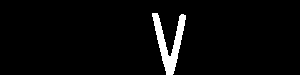

# Introdução

Uma empresa de tecnologia procura o desenvolvimento de um algoritmo que faça a deteção de matrículas de veículos e extraia os seus caracteres, especificamente, de matrículas portuguesas, para gestão de entradas e saídas das instalações da empresa.
O algoritmo deve ser constituído por quatro módulos:

-	**Deteção da matrícula**: módulo responsável pela deteção das matrículas. Neste módulo serão recolhidas imagens de veículos com matrícula portuguesa, com as quais será criado um dataset utilizado para treinar um modelo de deep learning. Depois do treino, os pesos (um ficheiro do tipo .pt, por exemplo, “best.pt”), gerados durante o treino, serão utilizados para efetuar inferências sobre imagens nunca antes vistas. Por fim, guardar as imagens com as anotações feitas durante as inferências e os respetivos ficheiros (do tipo .txt) que contêm as coordenadas das bounding boxes, de forma a ser utilizado no próximo módulo. 

-	**Recorte da imagem com base nas coordenadas da bounding box**: módulo responsável por pelo recorte da área onde foi detetada a matrícula. Com os valores presentes em cada ficheiro, calcular as coordenadas do canto superior esquerdo e o canto inferior direito da bouding box. Por fim, utilizar uma biblioteca que permita processar digitalmente imagens (OpenCV) para efetuar o recorte da área da bounding box e guardar as novas imagens que apenas contêm a matrícula.

-	 **Pipeline de processamento digital de imagem**: módulo responsável por extrair os caracteres presentes nas imagens recortadas, obtidas no módulo anterior. De forma a atingir este objetivo existem várias abordagens que podem ser utilizadas:
o	OCR (Optical Character Recognition) - processo que converte imagens com texto em texto capaz de ser compreendido por computadores.
o	Pipeline de processamento digital de imagem - segmentação e extração dos caracteres utilizando técnicas de processamento de imagem.

-	**Análise de texto e correção de erros**: módulo responsável pela análise do texto extraído, de todas as imagens, e correção de potenciais erros cometidos pela abordagem utilizado no módulo anterior.


# Matrículas portuguesas

| **Matrícula** | **Ano** | **Formato** | **Pares de caracteres** |
|:-------------:|:-------:|:-------------------:|:-----------------------:|
|  | Até 1992 | AA-11-11 | Par 1 - 2 letras, 
                                                         Par 2 - 2 números,
                                                         Par 3 - 2 números |
|  | 1992 a 2005 | 11-11-AA | Par 1 - 2 números, Par 2 - 2 números, Par 3 - 2 letras |
|  | 2005 a 2020 | 11-AA-11 | Par 1 - 2 números, Par 2 - 2 letras, Par 3 - 2 números |
|  | Desde 2020 | AA-11-AA | Par 1 - 2 letras, Par 2 - 2 números, Par 3 - 2 letras |


# Diagrama de funcionamento do algoritmo:


# Conteúdo
- [Plataformas](#Plataformas)
- [Recursos](#Recursos)
- [Módulo 1 - Deteção da matrícula](#módulo-1---deteção-da-matrícula)
  - [Construção do dataset](#construção-do-dataset)
  - [Preparação do dataset (Roboflow)](#preparação-do-dataset-(roboflow))
    - [Criar projeto de deteção de objetos](#criar-projeto-de-deteção-de-objetos)
    - [Efetuar upload das imagens recolhidas](#efetuar-upload-das-imagens-recolhidas)
    - [Anotar as imagens](#anotar-as-imagens)
    - [Aplicar aumentações (opcional)](#aplicar-aumentações-(opcional))
    - [Efetuar download do dataset no formato desejado](#efetuar-download-do-dataset-no-formato-desejado)
  - [Acesso ao Google Drive](#acesso-ao-google-drive)
  - [Treino do dataset](#treino-do-dataset)
    - [Métricas](#Métricas)
    - [Resultados do treino](#resultados-do-treino)
  - [Inferir sobre novas imagens](#inferir-sobre-novas-imagens)
- [Módulo 2 - Recorte da imagem com base nas coordenadas da bounding boxes](#módulo-2---Recorte-da-imagem-com-base-nas-coordenadas-da-bounding-boxes)
  - [Organização dos ficheiros com as bounding boxes](#organização-dos-ficheiros-com-as-bounding-boxes)
  - [Bibliotecas a utilizar](#bibliotecas-a-utilizar)
  - [Como utilizar a biblioteca glob](#Como-utilizar-a-biblioteca-glob)
  - [Abrir e ler os ficheiros](#Abrir-e-ler-os-ficheiros)
  - [Reverter a normalização das coordenadas geradas pela inferência](#reverter-a-normalização-das-coordenadas-geradas-pela-inferência)
  - [Calcular as coordenadas dos ponto superior esquerdo e do ponto inferior direito](#calcular-as-coordenadas-dos-ponto-superior-esquerdo-e-do-ponto-inferior-direito)
  - [Efetuar o recorte da imagem com base nas coordenadas calculadas](#efetuar-o-recorte-da-imagem-com-base-nas-coordenadas-calculadas)
- [Módulo 3 - Pipeline de processamento digital da imagem](#módulo-3---pipeline-de-processamento-digital-da-imagem)
  - [Abordagem 1 - Utilização de uma biblioteca OCR (Optical Character recognition)](#abordagem-1---Utilização-de-uma-biblioteca-OCR-(optical-Character-recognition))
    - [Instalar a biblioteca PaddleOCR](#instalar-a-biblioteca-PaddleOCR)
    - [Bibliotecas](#Bibliotecas)
    - [Carregar o modelo responsável pelo reconhecimento de texto](#carregar-o-modelo-responsável-pelo-reconhecimento-de-texto)
    - [Aplicar o OCR sobre uma imagem](#aplicar-o-ocr-sobre-as-imagens)
    - [Resultados do OCR](#resultados-do-ocr)
    - [Exemplo de um resultado da aplicação do OCR](#exemplo-de-um-resultado-da-aplicação-do-ocr)
  - [Abordagem 2 - Aplicação do método de Otsu](#abordagem-2---aplicação-do-método-de-otsu)
    - [Bibliotecas](#bibliotecas)
    - [Pré-processamento das imagens](#pré-processamento-das-imagens)
    - [Aplicar o algoritmo de Otsu](#aplicar-o-algoritmo-de-Otsu)
    - [Verificar o número de píxeis pretos](#verificar-o-número-de-píxeis-pretos)
    - [Calcular contours da imagem binarizada](#calcular-contours-da-imagem-binarizada)
    - [Com base nos contours extrair os caracteres](#com-base-nos-contours-extrair-os-caracteres)
    - [Extração e classificação dos caracteres](#extração-e-classificação-dos-caracteres)
    - [Modelo de classificação de caracteres](#modelo-de-classificação-de-caracteres)
    - [Bibliotecas](#bibliotecas)
    - [Classificar o caracter](#classificar-o-caracter)
  - [Abordagem 3 - Utilização da biblioteca Grounding Dino (deteção de caracteres) e Segment Anything Model (segmentação de caracteres)](#abordagem-3---utilização-da-biblioteca-grounding-dino-(deteção-de-caracteres)-e-segment-anything-model-(segmentação-de-caracteres))
    - [Instalar bibliotecas Grounding Dino e Segment Anythin Model (SAM)](#instalar-bibliotecas-grounding-dino-e-segment-anythin-model-(SAM))
    - [Aplicar do Grounding Dino sobre as imagens](#aplicar-do-grounding-dino-sobre-as-imagens)
    - [Aplicar o SAM sobre as imagens geradas pelo Grounding Dino](#aplicar-o-sam-sobre-as-imagens-geradas-pelo-grounding-dino)
    - [Obter as máscaras geradas](#obter-as-máscaras-geradas)
    - [Calcular contours da imagem binarizada](#calcular-contours-da-imagem-binarizada)
    - [Extração e classificação dos caracteres](#extração-e-classificação-dos-caracteres)
    - [Modelo de classificação de caracteres](#modelo-de-classificação-de-caracteres)
    - [Bibliotecas](#bibliotecas)
    - [Classificar o caracter](#classificar-o-caracter)
- [Módulo 4 - Análise de texto e correção de erros](#módulo-4---Análise-de-texto-e-correção-de-erros)
  - [Erros nos resultados obtidos pelo OCR e classificação de caracteres](#erros-nos-resultados-obtidos-pelo-ocr-e-classificação-de-caracteres)
  - [Correção de erros](#correção-de-erros)
  - [Resultados](#resultados)
  - [Comparar resultados com as matrículas reais](#comparar-resultados-com-as-matrículas-reais)


# Plataformas

| **Recursos** | **Utilização** | **Materiais de apoio** |
|:--------------:|:----------------:|:------------------------:|
| [Google Colab](https://colab.google/) | Desenvolvimento do algoritmo | [Tutorial](https://colab.research.google.com/)
| [Google Drive](https://www.google.com/drive/) | Armazenamento dos datasets e dos notebooks | [Tutorial](https://support.google.com/drive/answer/2424384?hl=en&co=GENIE.Platform=Desktop)
| [Roboflow](https://roboflow.com/) | Preparação de dados | [Tutorial](https://blog.roboflow.com/getting-started-with-roboflow/)


# Recursos 

| **Recursos** | **Utilização** | **Materiais de apoio** | **Repositório/Artigo** |
|:--------------:|:----------------:|:------------------:|:----------------------:|
| [YOLO (You Only Look Once)](https://github.com/ultralytics) | Treino de um modelo de deep learning utilizando o dataset criado | [](https://colab.research.google.com/github/ultralytics/yolov5/blob/master/tutorial.ipynb) | [](https://github.com/ultralytics) |
| [PaddleOCR](https://github.com/PaddlePaddle/PaddleOCR/blob/release/2.7/README_en.md) | Deteção e classificação de texto  (abordagem 1) | [](https://github.com/PaddlePaddle/PaddleOCR/blob/release/2.7/doc/doc_en/quickstart_en.md#22-use-by-code) | [](https://github.com/PaddlePaddle/PaddleOCR/blob/release/2.7/README_en.md) [](https://arxiv.org/abs/2009.09941) |
| [Método de Otsu](https://en.wikipedia.org/wiki/Otsu%27s_method) | Segmentação de imagens (abordagem 2) | [OpenCV](https://docs.opencv.org/3.4/d7/d4d/tutorial_py_thresholding.html) [Algoritmo](https://en.wikipedia.org/wiki/Otsu%27s_method#Python_implementation) |  |
| [Grounding Dino](https://github.com/IDEA-Research/GroundingDINO) | Deteção automática de objetos com base num prompt (abordagem 3) | [](https://colab.research.google.com/github/roboflow-ai/notebooks/blob/main/notebooks/zero-shot-object-detection-with-grounding-dino.ipynb) | [](https://github.com/IDEA-Research/GroundingDINO) [](https://arxiv.org/abs/2303.05499)
| [Segment Anything Model](https://github.com/facebookresearch/segment-anything) | Segmentação automática de objetos (abordagem 3) | [](https://colab.research.google.com/github/roboflow-ai/notebooks/blob/main/notebooks/how-to-segment-anything-with-sam.ipynb) | [](https://github.com/facebookresearch/segment-anything) [](https://arxiv.org/abs/2304.02643) |

# Módulo 1 - Deteção da matrícula

## Construção do dataset

O dataset deve ser constituído por imagens diurnas (tiradas manualmente, obtidas da Internet, vídeo, etc..) de veículos (carros, carrinhas, camiões, motas...) com matrícula portuguesa frontais e traseiras sem muita angulação (vertical ou horizontal) em que os caracteres das da matrícula sejam bem visíveis. A condição de iluminação das imagens também deve ser variada. Quantas mais imagens melhor, embora o tempo de anotação seja maior (sugestão: 200 a 500 imagens). 

<div align="center">

| **Imagens adequadas para o treino** | **Imagens não adequadas para o treino** | 
|:----:|:----:|
|||
|||
|||
|||


</div>

### Preparação do dataset (Roboflow)

Criar uma conta [Roboflow](https://app.roboflow.com/login), caso necessário.


#### Criar projeto de deteção de objetos

Colocar video

#### Efetuar upload das imagens recolhidas

Colocar video

#### Anotar as imagens

Colocar video

#### Aplicar aumentações (opcional)

As aumentações são opcionais, uma vez que os resultados do treino podem bons mesmo se as utilizar.
São úteis quando os dados são poucos.

Caso sejam necessárias, as seguintes são as mais pertinentes:

- **Flip** (horizontal)
- **Crop** (5 a 10%)
- **Rotation** (-15 a 15 graus)
- **Brightness** (brighten e darken, -15 a 15%)
- **Blur** (1.25 píxeis)
- **Noise** (3%)

Os valores indicados em cada uma das aumentações podem e devem ser alterados.

Colocar video para cada aumentação

#### Efetuar download do dataset no formato desejado

Efetuar o download do dataset no formato do modelo a utilizar no treino e colocar no Google Drive.

Colocar Video

## Acesso ao Google Drive

```bash

from google.colab import drive

drive.mount('/content/drive/') # nome da diretoria onde serão colocados os ficheiros do Google Drive -> /nome_da_pasta/MyDrive/

# os conteúdos do Google Drive têm de estar numa diretoria vazia

```
## Treino do dataset

YOLOv5 é utilizado como exemplo.

Instalação de bibliotecas:

```bash

# entrar na diretoria do YOLO
%cd /content/caminho/yolov5

!pip install -qr requirements.txt  # instala as dependências listadas no ficheiro (apenas as que ainda não estão instaladas)

```

Parâmetros a ter em conta:

- **epochs** -> número de iterações do treino
- **batch** -> o número de imagens utilizadas em cada iteração - este número deve ter em conta o tamanho da imagem e a memória de vídeo da placa gráfica
- **img** -> tamanho da imagem utilizado como input
- **patience** -> o número de “epochs” necessárias em que não existe melhoria da loss de validação para parar o treino automaticamente
- **name** -> o nome da diretoria onde são guardados os resultados do treino
- **cfg** -> modelo a utilizar, por exemplo, yolov5s.yaml, yolov5m.yaml, yolov5l.yaml, yolov5x.yaml (substituir o número 5, tendo em conta a versão do modelo utilizada)
- **weights** -> utilizar um modelo pré-treinado ou YOLO (por exemplo, yolov5s.pt, yolov5m.pt, yolov5l.pt, yolov5x.pt - substituir o número 5, tendo em conta a versão do modelo utilizada) ou personalizado (por exemplo, best.pt)


```bash

# exemplo de treino que utiliza o modelo yolov5l e os pesos pré-treinados do modelo yolov5l
!python train.py --img 256 --batch 24 --epochs 2 --data  /content/caminho/data.yaml --cfg ./models/yolov5l.yaml --weights yolov5l --name resultados  --cache --exist-ok

```

# Métricas

- **Precision (P)** -> A acurácia de previsões positivas. Um valor alto de precisão indica que o modelo não gera previsões consideradas falsos positivos, o que siginifica que as previsões são confiáveis;
- **Recall (R)** -> Também chamada de sensibilidade (sensitivity), mede a proporção de verdadeiros positivos em relação ao total de instâncias positivas. Um valor alto de Recall indica que o modelo consegue identificar corretamente a maior parte das instâncias positivas;
- **mAP** (mean Average Precision)-> A média da precisão tendo em conta todas as classes do dataset;
  - **mAP50** -> A média da precisão de todas as classes tendo em conta um valor de IoU (Intersection over Union - o valor de interseção entre a bounding box anotada e a bounding box gerada pelo modelo) de 0.5;
  - **mAP50-95** -> A média da precisão de todas as classes, no intervalo entre 0.5 e 0.95 de IoU com um incremento, tipicamente, de 0.05.


### Resultados do treino

Exemplo de resultados de um treino:

```bash

Class     Images  Instances          P          R      mAP50   mAP50-95: 100%|██████████| 7/7 [00:04<00:00,  1.67it/s]
  all        209        223      0.973       0.98      0.993      0.754

```


Resultados do treino:

Os melhores resultados foram obtidos na iteração 414 e o treino parou na iteração 515, uma vez que não existiu uma melhoria dutante 100 iterações.

<div align="center">


</div>


Para efetuar de nova a validação, sem o treino:

```bash 

# para validar os resultados do treino é necessário utilizar o script val.py
# basta indicar o caminho para os pesos do treino e o tamanho de input das imagens

!python val.py --data /content/caminho/data.yaml --weights /content/caminho/best.pt--img 640 

# os resultados da validação são guardados na pasta runs/val

```

Exemplo de métricas de validação:

```bash

Class     Images  Instances          P          R      mAP50   mAP50-95: 100%|██████████| 7/7 [00:03<00:00,  2.27it/s]
  all        209        223      0.973       0.98      0.993      0.753

```

Para obter as métricas de teste:

```bash

# basta indicar o caminho para os pesos do treino, o tamanho de input das imagens e indicar --task test

!python val.py --data /content/caminho/data.yaml --weights /content/caminho/best.pt --img 640 

```

Exemplo de métricas de teste:

```bash

Class     Images  Instances          P          R      mAP50   mAP50-95: 100%|██████████| 5/5 [00:02<00:00,  1.80it/s]
  all        157        165      0.979      0.933      0.967      0.751
  
```


## Inferir sobre novas imagens

A confiança mínima utilizada deve ser de 0.65.
Utilizar o parâmetro "--save-txt" para guardar ficheiros com as coordenadas das bounding boxes detetadas. Caso não seja detetada nenhuma matrícula, o ficheiro não é gerado.

```bash

# para inferir é necessário utilizar o script detect.py
# basta indicar o caminho para os pesos do treino, o tamanho de input das imagens, a confiança mínima, caminho das imagens,
# o caminho onde são guardadas os resultados e indicar que se pretende guardar as coordenadas das bounding boxes -> --save-txt

!python detect.py --weights /content/drive/MyDrive/Exemplo_Codigo/weights/best.pt --img 512 --conf 0.65 --source /content/drive/MyDrive/Exemplo_Codigo/datasets/inferencias/exemplo_carros --name resultados --save-txt

# na consola encontram-se os resultados das métricas

# os resultados da inferência são guardados na pasta runs/detect

```


# Módulo 2 - Recorte da imagem com base nas coordenadas da bounding boxes

## Organização dos ficheiros com as bounding boxes

Cada ficheiro tem pelo menos uma linha de texto constituído por cinco valores:

- **class** -> classe do objeto detetado, não é relevante para o problema em questão;
- **x** -> valor de x, do centro da bounding box;
- **y** -> valor de y, do centro da bounding box;
- **width** -> largura da bounding box;
- **height** -> altura da bounding box.

<div align="center">


</div>

Exemplo de um ficheiro de inferência:

<div align="center">


</div>


## Bibliotecas a utilizar

```bash

import cv2 # OpenCV, abrir e guardar imagens
import glob # obtém os caminhos todos os ficheiros presentes na diretoria dada, pastas inclusive

```

## Como utilizar a biblioteca glob

```bash

# alterar pasta onde se encontram as labels, se necessário
diretoria_labels = "/content/caminho/labels/*" # caminho termina com *, indica todos os ficheiros presentes na diretoria

# sorted ordena alfabeticamente os nomes dos caminhos
for item in sorted(glob.iglob(diretoria_labels)):

  print(item) # cada valor de item é uma string que corresponde ao caminho do ficheiro

```

# Abrir e ler os ficheiros

```bash

coordenadas = [] # guardará as coordenadas do ficheiro

# abrir o ficheiro
f = open(item)

# ler todas as linhas do ficheiro
linhas = f.readlines()

for linha in linhas: # percorrer todas as linhas

  # remover parágrafos caso existam
  l = linha.replace("\n", "")

  # obter cada valor
  # cada valor encontra-se separado por um espaço
  temp = l.split(" ")

  cc = [float(temp[1]), float(temp[2]), float(temp[3]), float(temp[4])]

  # guardar as coordenadas
  coordenadas.append(cc)

# fechar o ficheiro
f.close()

```


### Reverter a normalização das coordenadas geradas pela inferência

```bash

imagem = cv2.imread(item)

# largura e altura da imagem aberta
largura_imagem = imagem.shape[1]
altura_imagem = imagem.shape[0]

# calcular coordenadas desnormalizadas
des_x = coordenadas[0][0] * largura_imagem
des_y = coordenadas[0][1] * altura_imagem
des_width = coordenadas[0][2] * largura_imagem
des_height = coordenadas[0][3] * altura_imagem

```

## Calcular as coordenadas dos ponto superior esquerdo e do ponto inferior direito

```bash

bb_thickeness = 4 # para remover a bounding box

# cálculo do ponto superior esquerdo (xmin, ymax) e do ponto inferior direito (xmax, ymin)
xmin = des_x - des_width + des_width / 2 + bb_thickeness 
xmax = des_x + des_width - des_width / 2 - bb_thickeness
ymin = des_y - des_height + des_height / 2 + bb_thickeness
ymax = des_y + des_height - des_height / 2 - bb_thickeness

```

## Efetuar o recorte da imagem com base nas coordenadas calculadas

```bash

# recorte da imagem
imagem_crop = imagem[int(ymin) : int(ymax), int(xmin) : int(xmax)]

```

<div align="center">


</div>


# Módulo 3 - Pipeline de processamento digital da imagem

## Abordagem 1 - Utilização de uma biblioteca OCR (Optical Character recognition)

### Instalar a biblioteca PaddleOCR

```bash

# Instalar PaddleOCR
!pip install paddlepaddle-gpu
!pip install paddleocr
!wget http://archive.ubuntu.com/ubuntu/pool/main/o/openssl/libssl1.1_1.1.0g-2ubuntu4_amd64.deb
!sudo dpkg -i libssl1.1_1.1.0g-2ubuntu4_amd64.deb
!git clone https://github.com/PaddlePaddle/PaddleOCR

```

### Bibliotecas:

```bash

from paddleocr import PaddleOCR, draw_ocr # paddleOCR
from PIL import Image # abrir imagens

```

### Carregar o modelo responsável pelo reconhecimento de texto

```bash

# carregar o modelo
# apenas é necessário fazer uma vez por runtime
ocr = PaddleOCR(use_angle_cls = True, lang = 'en') # lang define a língua que o modelo deve reconhecer

```
  
### Aplicar o OCR sobre uma imagem


```bash

imagem = '/content/caminho/imagem'

resultado = ocr.ocr(imagem, cls = True)

```

### Resultados do OCR

O resultado do OCR é um array do qual é possível extrair:

- todas as deteções efetuadas;

```bash

  boxes = [line[0] for line in result] # coordenadas das bounding boxes

```

- o texto presente em cada bounding box;

```bash

  txts = [line[1][0] for line in result ] # texto detetado

```

- a confiança da classificação do texto;

```bash

  scores = [line[1][1] for line in result] # confiança das deteções

```

### Exemplo de um resultado da aplicação do OCR

<div align="center">


</div>


## Abordagem 2 - Aplicação do método de Otsu

### Bibliotecas

```bash

import cv2
from imutils import contours

```

### Pré-processamento das imagens

Abrir imagem e converter para preto e branco:

```bash

img = "/content/caminho/imagem"

imagem = cv2.imread(img, cv2.IMREAD_GRAYSCALE) # carregar imagem e converter a imagem para preto e branco

```

<div align="center">


</div>

Redimensionar imagem:

```bash

imagem_redimensionada = cv2.resize(imagem, (300, 75), interpolation=cv2.INTER_AREA) # redimensionar a imagem

```

<div align="center">


</div>

Máscara dos contours:

```bash

mask = np.zeros(imagem_redimensionada.shape, dtype=np.uint8) # criar uma máscara

```
<div align="center">


</div>

### Aplicar o algoritmo de Otsu

```bash

thresh = cv2.threshold(imagem_redimensionada, 0, 255, cv2.THRESH_BINARY_INV + cv2.THRESH_OTSU)[1] # aplicar o método

```
<div align="center">


</div>

### Verificar o número de píxeis pretos

O cálculo dos contours, próximo passo, apenas funciona se o fundo for preto e os caracteres brancos. 

```bash

largura = imagem_redimensionada.shape[0] # largura da imagem
altura = imagem_redimensionada.shape[1] # altura da imagem

non_zero = cv2.countNonZero(thresh) # obter o número de pixeis não pretos

if non_zero > (w * h) / 2:

  thresh = cv2.bitwise_not(temp) # inverter a cor dos pixeis

```

### Calcular contours da imagem binarizada

```bash

cnts = cv2.findContours(thresh, cv2.RETR_EXTERNAL, cv2.CHAIN_APPROX_SIMPLE) # encontrar contours
cnts = cnts[0] if len(cnts) == 2 else cnts[1]

(cnts, _) = contours.sort_contours(cnts, method="left-to-right") # ordenar os contours da esquerda para a direita

```


### Extração e classificação dos caracteres

Cálculo da área de cada contour encontrado:

- **x** - centro do contour
- **y** - centro do contour 
- **w** - largura do contour
- **h** - altura do contour

```bash

    area = cv2.contourArea(c) # calcular a área do contour
    x, y, w, h = cv2.boundingRect(c) # obter os valores da bounding box (x (centro da bounding box), y (centro da bounding box), largura, altura)

```

Definir a condição que identifica caracteres:

Por exemplo:

```bash

if 100 < area < 500 and w < 50 and h > 20:

```

Recortar imagem:

```bash

char = 255 - imagem[y: y + h, x: x + w] # a área a recortar

```

Caracteres extraídos:

<div align="center">

     

</div>

Máscara gerada:

<div align="center">


</div>

Redimensionar a imagem recortada para ser utilizada pelo classificador:

```bash

# redimensionar o caracter
char = cv2.resize(char, (50, 50), interpolation = cv2.INTER_AREA)
char = np.expand_dims(char, axis = 0)

```

### Modelo de classificação de caracteres

Um modelo de classificação criado utilizando keras.

### Bibliotecas

```bash

from tensorflow import keras
from tensorflow.keras import layers

```

```bash

input_shape = (50, 50, 1) # input que o modelo aceita
num_classes = 36 # número de classes
classes = ['0', '1', '2', '3', '4', '5', '6', '7', '8', '9', 'A', 'B', 'C', 'D', 'E',
              'F', 'G', 'H', 'I', 'J', 'K', 'L', 'M', 'N', 'O', 'P', 'Q', 'R', 'S', 'T',
              'U', 'V', 'W', 'X', 'Y', 'Z'] # nomes das classes

# modelo de classificação
model = keras.Sequential(
    [
        layers.Dense(32, input_shape = input_shape),
        layers.Dense(64, activation = 'relu'),
        layers.Flatten(),
        layers.Dense(num_classes, activation = 'softmax'),
    ]
)

```

Carregar pesos pré-treinados:

```bash

# carregar os pesos
model.load_weights('/content/caminho/pesos')

```

# Classificar o caracter

```bash

# classificar caracter
previsao =  model.predict(char)
classe_prevista = classes[np.argmax(previsao)]

```

## Abordagem 3 - Utilização da biblioteca Grounding Dino (deteção de caracteres) e Segment Anything Model (segmentação de caracteres)

### Instalar bibliotecas Grounding Dino e Segment Anythin Model (SAM)

Instalar Grounding Dino

```bash

# Instalar repositório do Grounding Dino
!git clone https://github.com/IDEA-Research/GroundingDINO.git
%cd /content/GroundingDINO/
!pip install -e .

```
Instalar SAM (Segment Anything Model)

```bash

# Instalar repositórios SAM
!pip install git+https://github.com/facebookresearch/segment-anything.git

```

Bibliotecas:

```bash

import argparse
import os
import copy

import GroundingDINO.groundingdino.datasets.transforms as T
from GroundingDINO.groundingdino.models import build_model
from GroundingDINO.groundingdino.util import box_ops
from GroundingDINO.groundingdino.util.slconfig import SLConfig
from GroundingDINO.groundingdino.util.utils import clean_state_dict, get_phrases_from_posmap
from GroundingDINO.groundingdino.util.inference import annotate, load_image, predict

# Carregar modelos
from huggingface_hub import hf_hub_download

import torch
from PIL import Image

# segment anything
from segment_anything import build_sam, SamPredictor
import cv2
import numpy as np

import locale
locale.getpreferredencoding = lambda: "UTF-8"

```

### Aplicar do Grounding Dino sobre as imagens

Função que carrega o modelo Grounding Dino

```bash

# Carregar modelo GroundingDINO
def load_model_hf(repo_id, filename, ckpt_config_filename, device ='cpu'):

    cache_config_file = hf_hub_download(repo_id = repo_id, filename = ckpt_config_filename)

    args = SLConfig.fromfile(cache_config_file)
    model = build_model(args)
    args.device = device

    cache_file = hf_hub_download(repo_id = repo_id, filename = filename)
    checkpoint = torch.load(cache_file, map_location = 'cpu')
    log = model.load_state_dict(clean_state_dict(checkpoint['model']), strict = False)
    print("Model loaded from {} \n => {}".format(cache_file, log))
    _ = model.eval()

    return model

```


Caminhos dos pesos e modelo do Grounding Dino a utilizar:

```bash

# Caminhos GroundingDINO
ckpt_repo_id = "ShilongLiu/GroundingDINO"
ckpt_filenmae = "groundingdino_swinb_cogcoor.pth"
ckpt_config_filename = "GroundingDINO_SwinB.cfg.py"

```


Carregar o modelo Grounding Dino:


```bash

# Carregar modelo
groundingdino_model = load_model_hf(ckpt_repo_id, ckpt_filenmae, ckpt_config_filename)

```

Aplicar Grounding Dino sobre imagens:

```bash

# Correr GroundingDINO

imagem = "/content/caminho/imagem.png"

TEXT_PROMPT = "dog" # prompt utilizado para a deteção
BOX_TRESHOLD = 0.3 # similaridade de cada deteção
TEXT_TRESHOLD = 0.25 # similaridade do texto em relação ao que foi detetado

image_source, image = load_image(item)

# a predição retorna todas as bounding boxes, logits (confiança) e a palavra/frase que deu origem à deteção
boxes, logits, phrases = predict(
    model = groundingdino_model,
    image = image,
    caption = TEXT_PROMPT,
    box_threshold = BOX_TRESHOLD,
    text_threshold = TEXT_TRESHOLD
)

```

<div align="center">


</div>


### Carregar modelo SAM

```bash

# Carregar modelo Segment Anything Model
!wget https://dl.fbaipublicfiles.com/segment_anything/sam_vit_h_4b8939.pth

sam_checkpoint = 'sam_vit_h_4b8939.pth' # pesos
sam = build_sam(checkpoint = sam_checkpoint)
sam.to(device = "cpu")
sam_predictor = SamPredictor(sam)

```

### Aplicar SAM sobre as imagens geradas pelo Grounding Dino

Correr SAM sobre a imagem gerada pelo Grounding Dino:


```bash

# Correr Segment Anything Model
sam_predictor.set_image(image_source)

```


Normalizar as bounding boxes:


```bash 

# normalizar as bounding boxes
H, W, _ = image_source.shape
boxes_xyxy = box_ops.box_cxcywh_to_xyxy(boxes) * torch.Tensor([W, H, W, H])

```


Previsão das máscaras:

```bash

transformed_boxes = sam_predictor.transform.apply_boxes_torch(boxes_xyxy, image_source.shape[:2]).to("cpu")

masks, _, _ = sam_predictor.predict_torch(
            point_coords = None,
            point_labels = None,
            boxes = transformed_boxes,
            multimask_output = False,
        )

```


Obter as máscaras:

```bash

# Função que retorna as máscaras
def get_masks(mask):

    color = np.array([255/255, 255/255, 255/255, 1])

    h, w = mask.shape[-2:]

    mask_image = mask.reshape(h, w, 1) * color.reshape(1, 1, -1)

    just_mask = Image.fromarray((mask_image.cpu().numpy() * 255).astype(np.uint8)).convert("L")

    return just_mask

```

<div align="center">

  
  
  
  
  
  

</div>


### Calcular contours da imagem binarizada

```bash

cnts = cv2.findContours(thresh, cv2.RETR_EXTERNAL, cv2.CHAIN_APPROX_SIMPLE) # encontrar contours
cnts = cnts[0] if len(cnts) == 2 else cnts[1]

(cnts, _) = contours.sort_contours(cnts, method="left-to-right") # ordenar os contours da esquerda para a direita

```

### Extração e classificação dos caracteres

Cálculo da área de cada contour detetado:

- **x** - centro do contour
- **y** - centro do contour 
- **w** - largura do contour
- **h** - altura do contour

```bash

    area = cv2.contourArea(c) # calcular a área do contour
    x, y, w, h = cv2.boundingRect(c) # obter os valores da bounding box (x (centro da bounding box), y (centro da bounding box), largura, altura)

```

Definir a condição que identifica caracteres:

Por exemplo:

```bash

if 100 < area < 500 and w < 50 and h > 20:

```

Recortar imagem:

```bash

char = 255 - imagem[y: y + h, x: x + w] # a área a recortar

```

Caracteres extraídos:

<div align="center">

     

</div>

Máscara gerada:

<div align="center">


</div>

Redimensionar a imagem recortada para ser utilizada pelo classificador:

```bash

# redimensionar o caracter
char = cv2.resize(char, (50, 50), interpolation = cv2.INTER_AREA)
char = np.expand_dims(char, axis = 0)

```

### Modelo de classificação de caracteres

Um modelo de classificação criado utilizando keras.

### Bibliotecas

```bash

from tensorflow import keras
from tensorflow.keras import layers

```

```bash

input_shape = (50, 50, 1) # input que o modelo aceita
num_classes = 36 # número de classes
classes = ['0', '1', '2', '3', '4', '5', '6', '7', '8', '9', 'A', 'B', 'C', 'D', 'E',
              'F', 'G', 'H', 'I', 'J', 'K', 'L', 'M', 'N', 'O', 'P', 'Q', 'R', 'S', 'T',
              'U', 'V', 'W', 'X', 'Y', 'Z'] # nomes das classes

# modelo de classificação
model = keras.Sequential(
    [
        layers.Dense(32, input_shape = input_shape),
        layers.Dense(64, activation = 'relu'),
        layers.Flatten(),
        layers.Dense(num_classes, activation = 'softmax'),
    ]
)

```

Carregar pesos pré-treinados:

```bash

# carregar os pesos
model.load_weights('/content/caminho/pesos')

```

# Classificar o caracter

```bash

# classificar caracter
previsao =  model.predict(char)
classe_prevista = classes[np.argmax(previsao)]

```


# Módulo 4 - Análise de texto e correção de erros

### Erros nos resultados obtidos pelo OCR e classificação de caracteres

Verificar que erros existem nos resultados cometidos pelo OCR ou classificação de caracteres:

- O tem apenas seis caracteres?
- Existem caracteres que não sejam letras ou números?
- Existem caracteres que contêm um número e uma letra?
- Os pares de caracteres do resultado estão de acordo com a matrícula real?

### Correção de erros

Para remover ou substituir caracteres:

```bash

exemplo_string = "AA 11.11"

exemplo_string = exemplo_string.replace(' ', '') # remover o espaço

exemplo_string = exemplo_string.replace('.', '') # remover ponto final

```

### Resultados

O resultado de cada matrícula deve ser uma string com seis caracteres (letras e números), sem espaços.

Exemplo:

```bash

exemplo_resultado = "AA1111"

```

### Comparar resultados com as matrículas reais