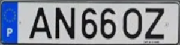

# Introdução

Uma empresa de tecnologia procura o desenvolvimento de um algoritmo que faça a deteção de matrículas de veículos e extraia os seus caracteres, especificamente, de matrículas portuguesas, para gestão de entradas e saídas das instalações da empresa.
O algoritmo deve ser constituído por quatro módulos:

-	**Deteção da matrícula**: módulo responsável pela deteção das matrículas. Neste módulo serão recolhidas imagens de veículos com matrícula portuguesa, com as quais será criado um dataset utilizado para treinar um modelo de deep learning. Depois do treino, os pesos (um ficheiro do tipo .pt, por exemplo, “best.pt”), gerados durante o treino, serão utilizados para efetuar inferências sobre imagens nunca antes vistas. Por fim, guardar as imagens com as anotações feitas durante as inferências e os respetivos ficheiros (do tipo .txt) que contêm as coordenadas das bounding boxes, de forma a ser utilizado no próximo módulo. 

-	**Recorte da imagem com base nas coordenadas da bounding box**: módulo responsável por pelo recorte da área onde foi detetada a matrícula. Com os valores presentes em cada ficheiro, calcular as coordenadas do canto superior esquerdo e o canto inferior direito da bouding box. Por fim, utilizar uma biblioteca que permita processar digitalmente imagens (OpenCV) para efetuar o recorte da área da bounding box e guardar as novas imagens que apenas contêm a matrícula.

-	 **Pipeline de processamento digital de imagem**: módulo responsável por extrair os caracteres presentes nas imagens recortadas, obtidas no módulo anterior. De forma a atingir este objetivo existem várias abordagens que podem ser utilizadas:
o	OCR (Optical Character Recognition) - processo que converte imagens com texto em texto capaz de ser compreendido por computadores.
o	Pipeline de processamento digital de imagem - segmentação e extração dos caracteres utilizando técnicas de processamento de imagem.

-	**Análise de texto e correção de erros**: módulo responsável pela análise do texto extraído, de todas as imagens, e correção de potenciais erros cometidos pela abordagem utilizado no módulo anterior.


# Matrículas portuguesas

| **Matrícula** | **Ano** | **Formato** | **Pares de caracteres** |
|:-------------:|:-------:|:-------------------:|:-----------------------:|
|  | Até 1992 | AA - 11 - 11 | Par 1 - 2 letras <br /> Par 2 - 2 números <br /> Par 3 - 2 números |
|  | 1992 a 2005 | 11 - 11 - AA | Par 1 - 2 números <br /> Par 2 - 2 números <br /> Par 3 - 2 letras |
|  | 2005 a 2020 | 11 - AA - 11 | Par 1 - 2 números <br /> Par 2 - 2 letras <br /> Par 3 - 2 números |
|  | Desde 2020 | AA - 11 - AA | Par 1 - 2 letras <br /> Par 2 - 2 números <br /> Par 3 - 2 letras |


# Diagrama de funcionamento do algoritmo:


# Conteúdo
- [Plataformas](#Plataformas)
- [Recursos](#Recursos)
- [Módulo 1 - Deteção da matrícula](#módulo-1---deteção-da-matrícula)
  - [Construção do dataset](#construção-do-dataset)
  - [Preparação do dataset (Roboflow)](#preparação-do-dataset-(roboflow))
    - [Criar projeto de deteção de objetos](#criar-projeto-de-deteção-de-objetos)
    - [Upload das imagens](#upload-das-imagens)
    - [Anotar as imagens](#anotar-as-imagens)
    - [Aplicar aumento de dados (opcional)](#aplicar-aumentações-(opcional))
    - [Efetuar download do dataset no formato desejado](#efetuar-download-do-dataset-no-formato-desejado)
  - [Acesso ao Google Drive](#acesso-ao-google-drive)
  - [Treino do dataset](#treino-do-dataset)
    - [Métricas](#Métricas)
    - [Resultados do treino](#resultados-do-treino)
  - [Inferir sobre novas imagens](#inferir-sobre-novas-imagens)
- [Módulo 2 - Recorte da imagem com base nas coordenadas da bounding boxes](#módulo-2---Recorte-da-imagem-com-base-nas-coordenadas-da-bounding-boxes)
  - [Organização dos ficheiros com as bounding boxes](#organização-dos-ficheiros-com-as-bounding-boxes)
  - [Bibliotecas a utilizar](#bibliotecas-a-utilizar)
  - [Como utilizar a biblioteca glob](#Como-utilizar-a-biblioteca-glob)
  - [Abrir e ler os ficheiros](#Abrir-e-ler-os-ficheiros)
  - [Reverter a normalização das coordenadas geradas pela inferência](#reverter-a-normalização-das-coordenadas-geradas-pela-inferência)
  - [Calcular as coordenadas dos ponto superior esquerdo e do ponto inferior direito](#calcular-as-coordenadas-dos-ponto-superior-esquerdo-e-do-ponto-inferior-direito)
  - [Efetuar o recorte da imagem com base nas coordenadas calculadas](#efetuar-o-recorte-da-imagem-com-base-nas-coordenadas-calculadas)
  - [Redimensionar e guardar imagem recortada](#redimensionar-e-guardar-imagem-recortada)
- [Módulo 3 - Pipeline de processamento digital da imagem](#módulo-3---pipeline-de-processamento-digital-da-imagem)
  - [Abordagem 1 - Utilização de uma biblioteca OCR (Optical Character recognition)](#abordagem-1---Utilização-de-uma-biblioteca-OCR-(optical-Character-recognition))
    - [Instalar a biblioteca PaddleOCR](#instalar-a-biblioteca-PaddleOCR)
      - [Bibliotecas](#Bibliotecas)
      - [Carregar o modelo responsável pelo reconhecimento de texto](#carregar-o-modelo-responsável-pelo-reconhecimento-de-texto)
      - [Aplicar o OCR sobre uma imagem](#aplicar-o-ocr-sobre-as-imagens)
      - [Resultados do OCR](#resultados-do-ocr)
    - [Exemplo de um resultado da aplicação do OCR](#exemplo-de-um-resultado-da-aplicação-do-ocr)
    - [Guardar resultados num ficheiro de texto](#guardar-resultados-num-ficheiro-de-texto)
  - [Abordagem 2 - Aplicação do método de Otsu](#abordagem-2---aplicação-do-método-de-otsu)
    - [Bibliotecas](#bibliotecas)
    - [Abrir imagem e converter para preto e branco](#abrir-imagem-e-converter-para-preto-e-branco)
    - [Aplicar o algoritmo de Otsu](#aplicar-o-algoritmo-de-Otsu)
    - [Verificar o número de píxeis pretos](#verificar-o-número-de-píxeis-pretos)
    - [Aplicar operação morfológica](#aplicar-operação-morfológica)
    - [Construção da máscara com os caracteres](#construção-da-máscara-com-os-caracteres)
      - [Análise de componentes](#análise-de-componentes)
      - [Inicializar a máscara](#inicializar-a-máscara)
      - [Definir valor máximo e mínimo de pixéis](#definir-valor-máximo-e-mínimo-de-pixéis)
      - [Percorrer todas as labels](#percorrer-todas-as-labels)
      - [Construir a máscara](#construir-a-máscara)
    - [Calcular contours da imagem binarizada](#calcular-contours-da-imagem-binarizada)
    - [Ordenar as bounding boxes dos contours da esquerda para a direita](#ordenar-as-bounding-boxes-dos-contours-da-esquerda-para-a-direita)
    - [Extração dos caracteres](#extração-dos-caracteres)
      - [Definição da condição que identifica caracteres](#definição-da-condição-que-identifica-caracteres)
      - [Recorte dos caracteres](#recorte-dos-caracteres)
      - [Caracteres extraídos](#caracteres-extraídos)
    - [Modelo de classificação de caracteres](#modelo-de-classificação-de-caracteres)
      - [Bibliotecas](#bibliotecas)
      - [Carregar pesos pré-treinados do modelo de classificação](#carregar-pesos-pré-treinados-do-modelo-de-classificação)
      - [Classificar o caracter](#classificar-o-caracter)
      - [Guardar resultados num ficheiro de texto](#guardar-resultados-num-ficheiro-de-texto)
  - [Abordagem 3 - Utilização da biblioteca Grounding Dino (deteção de caracteres) e Segment Anything Model (segmentação de caracteres)](#abordagem-3---utilização-da-biblioteca-grounding-dino-(deteção-de-caracteres)-e-segment-anything-model-(segmentação-de-caracteres))
    - [Instalar bibliotecas Grounding Dino e Segment Anythin Model (SAM)](#instalar-bibliotecas-grounding-dino-e-segment-anythin-model-(SAM))
    - [Instalar Grounding Dino](#instalar-grounding-dino)
    - [Instalar SAM (Segment Anything Model)](#instalar-SAM-(Segment-Anything-Model))
    - [Bibliotecas](#bibliotecas)
    - [Carregar modelo Grounding Dino](#carregar-modelo-grounding-dino)
    - [Aplicar do Grounding Dino sobre as imagens](#aplicar-do-grounding-dino-sobre-as-imagens)
    - [Carregar modelo SAM](#carregar-modelo-SAM)
    - [Aplicar SAM sobre as imagens geradas pelo Grounding Dino](#aplicar-sam-sobre-as-imagens-geradas-pelo-grounding-dino)
      - [Correr SAM sobre a imagem gerada pelo Grounding Dino](#correr-sam-sobre-a-imagem-gerada-pelo-grounding-dino)
      - [Normalizar as bounding boxes](#normalizar-as-bounding-boxes)
      - [Previsão das máscaras](#previsão-das-máscaras)
      - [Obter as máscaras geradas](#obter-as-máscaras-geradas)
      - [Calcular contours da imagem binarizada](#calcular-contours-da-imagem-binarizada)
    - [Extração dos caracteres](#extração-dos-caracteres)
      - [Definição da condição que identifica caracteres](#definição-da-condição-que-identifica-caracteres)
      - [Recorte dos caracteres](#recorte-dos-caracteres)
      - [Caracteres extraídos](#caracteres-extraídos)
    - [Modelo de classificação de caracteres](#modelo-de-classificação-de-caracteres)
      - [Bibliotecas](#bibliotecas)
      - [Carregar pesos pré-treinados do modelo de classificação](#carregar-pesos-pré-treinados-do-modelo-de-classificação)
      - [Classificar o caracter](#classificar-o-caracter)
      - [Guardar resultados num ficheiro de texto](#guardar-resultados-num-ficheiro-de-texto)
- [Módulo 4 - Análise de texto e correção de erros](#módulo-4---Análise-de-texto-e-correção-de-erros)
  - [Erros nos resultados obtidos pelo OCR e classificação de caracteres](#erros-nos-resultados-obtidos-pelo-ocr-e-classificação-de-caracteres)
  - [Correção de erros](#correção-de-erros)
  - [Resultados](#resultados)
  - [Comparar resultados com as matrículas reais](#comparar-resultados-com-as-matrículas-reais)


# Plataformas

| **Recursos** | **Utilização** | **Materiais de apoio** |
|:--------------:|:----------------:|:------------------------:|
| [Google Colab](https://colab.google/) | Desenvolvimento do algoritmo | [Tutorial](https://colab.research.google.com/)
| [Google Drive](https://www.google.com/drive/) | Armazenamento dos datasets e dos notebooks | [Tutorial](https://support.google.com/drive/answer/2424384?hl=en&co=GENIE.Platform=Desktop)
| [Roboflow](https://roboflow.com/) | Preparação de dados | [Tutorial](https://blog.roboflow.com/getting-started-with-roboflow/)


# Recursos 

| **Recursos** | **Utilização** | **Materiais de apoio** | **Repositório/Artigo** |
|:--------------:|:----------------:|:------------------:|:----------------------:|
| [YOLO (You Only Look Once)](https://github.com/ultralytics) | Treino de um modelo de deep learning utilizando o dataset criado | [](https://colab.research.google.com/github/ultralytics/yolov5/blob/master/tutorial.ipynb) | [](https://github.com/ultralytics) |
| [PaddleOCR](https://github.com/PaddlePaddle/PaddleOCR/blob/release/2.7/README_en.md) | Deteção e classificação de texto  (abordagem 1) | [](https://github.com/PaddlePaddle/PaddleOCR/blob/release/2.7/doc/doc_en/quickstart_en.md#22-use-by-code) | [](https://github.com/PaddlePaddle/PaddleOCR/blob/release/2.7/README_en.md) [](https://arxiv.org/abs/2009.09941) |
| [Método de Otsu](https://en.wikipedia.org/wiki/Otsu%27s_method) | Segmentação de imagens (abordagem 2) | [OpenCV](https://docs.opencv.org/3.4/d7/d4d/tutorial_py_thresholding.html) [Algoritmo](https://en.wikipedia.org/wiki/Otsu%27s_method#Python_implementation) |  |
| [Grounding Dino](https://github.com/IDEA-Research/GroundingDINO) | Deteção automática de objetos com base num prompt (abordagem 3) | [](https://colab.research.google.com/github/roboflow-ai/notebooks/blob/main/notebooks/zero-shot-object-detection-with-grounding-dino.ipynb) | [](https://github.com/IDEA-Research/GroundingDINO) [](https://arxiv.org/abs/2303.05499)
| [Segment Anything Model](https://github.com/facebookresearch/segment-anything) | Segmentação automática de objetos (abordagem 3) | [](https://colab.research.google.com/github/roboflow-ai/notebooks/blob/main/notebooks/how-to-segment-anything-with-sam.ipynb) | [](https://github.com/facebookresearch/segment-anything) [](https://arxiv.org/abs/2304.02643) |

# Módulo 1 - Deteção da matrícula

## Construção do dataset

O dataset deve ser constituído por imagens diurnas (tiradas manualmente, obtidas da Internet, vídeo, etc..) de veículos (carros, carrinhas, camiões, motas...) com matrícula portuguesa frontais e traseiras sem muita angulação (vertical ou horizontal) em que os caracteres das da matrícula sejam bem visíveis. A condição de iluminação das imagens também deve ser variada. Quantas mais imagens melhor, embora o tempo de anotação seja maior (sugestão: 200 a 500 imagens). 

<div align="center">

| **Imagens adequadas para o treino** | **Imagens não adequadas para o treino** | 
|:----:|:----:|
|||
|||
|||
|||


</div>

### Preparação do dataset (Roboflow)

Criar uma conta [Roboflow](https://app.roboflow.com/login), caso necessário.


#### Criar projeto de deteção de objetos

<div align="center">


</div>


#### Upload das imagens

<div align="center">


</div>

#### Anotar as imagens

<div align="center">


</div>

#### Distribuição de imagens

<div align="center">


</div>

#### Gerar dataset

<div align="center">


</div>

#### Aplicar aumento de dados (opcional)

O aumento de dados é opcional, uma vez que os resultados do treino podem bons mesmo se as utilizar.
São úteis quando os dados são poucos.

Caso sejam necessárias, as seguintes são as mais pertinentes:

- **Flip** (horizontal)

<div align="center">


</div>

- **Crop** (5 a 15%)

<div align="center">


</div>

- **Rotation** (-15 a 15 graus)

<div align="center">


</div>

- **Brightness** (brighten e darken, -15 a 15%)

<div align="center">


</div>

- **Blur** (1.25 píxeis)

<div align="center">


</div>

- **Noise** (5%)

<div align="center">


</div>

Os valores indicados em cada uma das aumentações podem e devem ser alterados.

#### Efetuar download do dataset no formato desejado

Efetuar o download do dataset no formato do modelo a utilizar no treino e colocar no Google Drive. Criar conta no [Google Drive](https://www.google.com/drive/) se necessário.

<div align="center">


</div>

# No Google Colab

## Acesso ao Google Drive

Permitir que o Google Drive seja acedido pelo Google Colab.

```bash

from google.colab import drive

drive.mount('/content/drive/') # nome da diretoria onde serão colocados os ficheiros do Google Drive -> /nome_da_pasta/MyDrive/

# os conteúdos do Google Drive têm de estar numa diretoria vazia

```
## Treino do dataset

YOLOv5 é utilizado como exemplo.


### Preparação para o treino 

Antes de prosseguir, adicionar o repositório da [YOLOv5](https://github.com/ultralytics).

Relativamente ao dataset exportado do Roboflow:

  1. Descomprimir o dataset;
  2. Abrir o ficheiro "data.yaml";
  3. Alterar os camimhos presentes no ficheiro para:

  train: /content/data/train/images
  val: /content/data/valid/images
  test: /content/data/test/images

  4. Guardar as alterações;
  5. Comprimir o dataset;
  6. Guardar o dataset no Google Drive.

Instalação de dependências do modelo YOLO:

  1. No lado esquerdo, escolher o tab "Ficheiros";
  2. Abrir as pastas onde se encontram o repositório do YOLOv5;
  3. Selecionar a pasta do YOLOv5 com o botão direito do rato;
  4. Escolher a opção "Copiar caminho";
  5. Na célula abaixo, substituir apenas a palavra "caminho" pelo caminho copiado.


### Dependências do modelo YOLO

```bash

# entrar na diretoria do YOLO
%cd caminho

!pip install -qr requirements.txt  # instala as dependências listadas no ficheiro (apenas as que ainda não estão instaladas)

```

### Unzip do dataset

Obter o caminho da diretoria onde se encontra o dataset:
  1. No lado esquerdo, escolher o tab "Ficheiros";
  2. Abrir as pastas onde se encontra o dataset;
  3. Selecionar a pasta do dataset com o botão direito do rato;
  4. Escolher a opção "Copiar caminho";
  5. Na célula abaixo, substituir apenas a palavra "caminho" pelo caminho copiado.

```bash

# unzip do dataset

# alterar caminho
!unzip caminho -d /content/data/

# -d /content/data/ -> cria uma pasta com nome "data" e coloca o que se encontra no zip na mesma
```
Variáveis que afetam a performance do modelo.

- img -> dimensão do input - as imagens serão ajustadas tendo em conta o valor definido. Quanto maior for a imagem mais detalhe é possível extrair, mas maior será o valor de memória de vídeo utilizado.
- batch -> dados de treino utilizados em cada iteração. O valor escolhido deve ter em conta o tamanho do input. Por norma, quanto maior for o input menor será o valor de cada batch;
- epochs -> número de iterações que o treino vai efetuar;
- data -> diretoria onde se encotra o ficheiro "data.yaml", presente na pasta do dataset:
  - Na pasta "Data", selecionar o ficheiro "data.yaml" com o botão direito;
  - Escolher a opção "Copiar caminho";
  - Na célula abaixo, substituir apenas as palavras "caminho pesos" pelo caminho copiado;
- cfg -> modelo a ser utilizado para efetuar o treino:
  - yolov5n -> n - nano;
  - yolov5s -> s - small;
  - yolov5m -> m - medium;
  - yolov5l -> l - large;
  - yolov5x -> x - extra large;

  A utilização de modelos maiores requerem mais tempo por cada iteração, mas podem permitir a obtenção de melhores resultados.

  Os modelos encontram-se no repositório do YOLOv5:
  - Diretoria "models";
  - Selecionar o modelo pretendido com o botão direito;
  - Escolher a opção "Copiar caminho";
  - Na célula abaixo, substituir apenas as palavras "caminho modelo" pelo caminho copiado;

- weights -> pesos pré-treinados, de um dos modelo mencionados acima. O nome do modelo tem de ser colocado entre aspas. A sua utilização é opcional, mas no contexto do problema pode acelerar o treino.
  - yolov5n.pt
  - yolov5s.pt
  - yolov5m.pt
  - yolov5l.pt
  - yolov5x.pt

- name -> o nome da diretoria onde serão guardados os resultados. Sempre que for efetuado um treino será incrementado um valor ao nome definido. Se o nome definido for "resultados":
  - 1º treino -> resultados
  - 2º treino -> resultados2
  - 3ª treino -> resutlados3

  Os resultados de cada treino encontram-se na diretoria do repositório do YOLOv5:
  - runs/train


```bash

# exemplo de treino que utiliza o modelo yolov5l e os pesos pré-treinados do modelo yolov5l
!python train.py --img 256 --batch 24 --epochs 2 --data  /content/caminho/data.yaml --cfg ./models/yolov5l.yaml --weights yolov5l --name resultados  --cache --exist-ok

```

### Exemplos de parâmetros

```bash

img = 256 # dimensão do input - as imagens serão ajustadas tendo em conta o valor definido
batch = 100 # dados de treino utilizados em cada iteração
epochs = 5 # número de iterações
data = caminho # -> ficheiro data.yaml -> ficheiro que contém o caminho para as diferentes diretorias
cfg = caminho modelo # yolov5x, yolov5l, yolov5m, yolov5s -> s - small, m - medium, l -large, x - extra large -> quanto maior for o modelo mais lento será o treino
weights = "yolov5m.pt" # pesos pré-treinados -> opcional, pode acelerar o treino (melhores resultados mais depressa)
name = "resultados" # nome da diretoria onde serão guardados os resultados

```

### Treino do modelo

```bash 

# efetuar o treino
!python train.py --img {img} --batch {batch} --epochs {epochs} --data {data} --cfg {cfg} --weights {weights} --name {name}  --cache

# train.py -> script para efetuar o treino que se encontra na diretoria da YOLO

```

### Métricas

- **Precision (P)** -> A precisão de previsões positivas. Um valor alto de precisão indica que o modelo não gera previsões consideradas falsos positivos, o que siginifica que as previsões são confiáveis;
- **Recall (R)** -> Também chamada de sensibilidade (sensitivity), mede a proporção de verdadeiros positivos em relação ao total de instâncias positivas. Um valor alto de Recall indica que o modelo consegue identificar corretamente a maior parte das instâncias positivas;
- **mAP** (mean Average Precision)-> A média da precisão tendo em conta todas as classes do dataset;
  - **mAP50** -> A média da precisão de todas as classes tendo em conta um valor de IoU (Intersection over Union - o valor de interseção entre a bounding box anotada e a bounding box gerada pelo modelo) de 0.5;
  - **mAP50-95** -> A média da precisão de todas as classes, no intervalo entre 0.5 e 0.95 de IoU com um incremento, tipicamente, de 0.05.

Em todas as métricas, quanto mais próximo o valor for de 1, melhores os resultados.

----------------------------------------------------------------------------------------------------------

**Atenção**

**Bons resultados no treino não significa que os resultados, quando utilizadas imagens nunca antes vistas pelo modelo, também sejam bons.**


### Resultados do treino

Exemplo de resultados de um treino:

```bash

Class     Images  Instances          P          R      mAP50   mAP50-95: 100%|██████████| 7/7 [00:04<00:00,  1.67it/s]
  all        209        223      0.973       0.98      0.993      0.754

```


Resultados do treino:

Os melhores resultados foram obtidos na iteração 414 e o treino parou na iteração 515, uma vez que não existiu uma melhoria dutante 100 iterações (patience pré-definida é 100).

<div align="center">


</div>


Para efetuar de novo a validação, sem o treino:

```bash 

# para validar os resultados do treino é necessário utilizar o script val.py
# basta indicar o caminho para os pesos do treino e o tamanho de input das imagens

!python val.py --data /content/caminho/data.yaml --weights /content/caminho/best.pt --img 640 

# os resultados da validação são guardados na pasta runs/val

```

Exemplo de métricas de validação:

```bash

Class     Images  Instances          P          R      mAP50   mAP50-95: 100%|██████████| 7/7 [00:03<00:00,  2.27it/s]
  all        209        223      0.973       0.98      0.993      0.753

```


Para obter as métricas de teste:

Utilizar o mesmo código utilizado para obter as métricas da validação e adicionar o parâmetro "--task test".

```bash

# basta indicar o caminho para os pesos do treino, o tamanho de input das imagens e indicar --task test

!python val.py --data /content/caminho/data.yaml --weights /content/caminho/best.pt --img 640 --task test

```


Exemplo de métricas de teste:

```bash

Class     Images  Instances          P          R      mAP50   mAP50-95: 100%|██████████| 5/5 [00:02<00:00,  1.80it/s]
  all        157        165      0.979      0.933      0.967      0.751
  
```


## Inferências

### Parâmetros das inferências

Variáveis que afetam a performance do modelo.

- img -> dimensão do input - as imagens serão ajustadas tendo em conta o valor definido. Quanto maior for a imagem mais detalhe é possível extrair, mas maior será o valor de memória de vídeo utilizado;
- conf -> valor mínimo de confiança de cada deteção. Se o valor for menor que o valor definido, apesar de existirem deteções efetuadas pelo modelo estas não serão colocadas na imagem;
- data -> diretoria onde se encotra o ficheiro "data.yaml", presente na pasta do dataset:
  - Na pasta "Data", selecionar o ficheiro "data.yaml" com o botão direito;
  - Escolher a opção "Copiar caminho";
  - Na célula abaixo, substituir apenas as palavras "caminho pesos" pelo caminho copiado;
- weights -> pesos do treino efetuado. Os pesos encotram-se na diretoria do repositório do YOLOv5:
  - runs/train/resultados/weights, sendo resultados o nome da diretoria do último treino efetuado;
  - Selecionar com o botão direito do rato o ficheiro com o nome "best.pt";
  - Na célula abaixo, substituir as palavras "caminho pesos" pelo caminho copiado.
- images -> o caminho para as imagens que irão ser inferidas. Utilizar as imagens de teste do dataset:
  - Na diretoria "data", selecionar com o botão direito a diretoria "test/images";
  - Escolher a opção "Copiar caminho";
  - Na célula abaixo, substituir a palavra "caminho" pelo caminho copiado;
- inf_name -> o nome da diretoria onde serão guardados os resultados da inferência. Sempre que for efetuado uma inferência será incrementado um valor ao nome definido. Se o nome definido for "resultados_inferencia":

  - 1º treino -> resultados_inferencia
  - 2º treino -> resultados_inferencia2
  - 3ª treino -> resultados_inferencia3

  Os resultados de cada inferência encontram-se na diretoria do repositório do YOLOv5:
  - runs/detect

  Cada diretoria de resutados irá conter uma diretoria chamada "labels" e as imagens utilizadas, que podem ou não estar anotadas.
  A diretoria "labels" irá conter ficheiro do tipo ".txt" com as coordenadas das deteções.

-------------------------------------------------------------------------------
  ## **IMPORTANTE**
  
  ### **Cada imagem será guardada, tenha ou não deteções.**
  
  ### **O ficheiro, para cada imagem, apenas será gerado caso seja feita pelo menos uma deteção.**
-------------------------------------------------------------------------------

- bb_thickness -> espessura das linhas da bounding box;
- hide_labels -> esconde as labels da deteção;

Os dois últimos parâmetros são definidos para diminuir o espaço ocupado por cada bounding box.


### Exemplos de parâmetros

```bash

# alterar caminhos do treino se necessário
img = 256 # tamanho da imagem de input
conf = 0.65 # confiança mínima para que seja detetada uma classe
weights = caminho pesos # caminho dos weights do treino -> .../yolov5/yolo-master/runs/train/resultados/weights/best.pt
images = caminho # caminho das imagens -> pode ser uma pasta -> utilizar dados de teste
inf_name = "resultados_inferencia" # pasta onde ficam guardadas as imagens da inferência e os ficheiros txt
bb_thickness = 1 # espessura das linhas da bounding box
hide_labels = True # esconde a label da deteção

```

### Para efetuar as inferências

```bash

# efetuar inferênciass
!python detect.py --weights {weights} --img {img} --conf {conf} --source {image} --name {inf_name} --save-txt --line-thickness {bb_thickness} --hide-labels{hide_labels}

# --save-txt -> guarda as anotações efetuadas (ficheiros txt)

# detect.py -> script para efetuar inferências que se encontra na diretoria da YOLO

# os resultados da inferência são guardados no seguinte caminho
# .../yolov5/yolo-master/runs/detect/resultados_inferencia/

```


# Módulo 2 - Recorte da imagem com base nas coordenadas da bounding boxes

## Organização dos ficheiros com as bounding boxes

Cada ficheiro tem pelo menos uma linha de texto constituído por cinco valores:

- **class** -> classe do objeto detetado, não é relevante para o problema em questão;
- **x** -> valor de x, do centro da bounding box;
- **y** -> valor de y, do centro da bounding box;
- **width** -> largura da bounding box;
- **height** -> altura da bounding box.

<div align="center">


</div>

Exemplo de um ficheiro de inferência:

<div align="center">


</div>


## Bibliotecas a utilizar

```bash

import cv2 # OpenCV, abrir e guardar imagens
import glob # obtém os caminhos todos os ficheiros presentes na diretoria dada, pastas inclusive

```

## Como utilizar a biblioteca glob

```bash

# alterar pasta onde se encontram as labels, se necessário
diretoria_labels = "/content/caminho/labels/*" # caminho termina com *, indica todos os ficheiros presentes na diretoria

# sorted ordena alfabeticamente os nomes dos caminhos
for item in sorted(glob.iglob(diretoria_labels)):

  print(item) # cada valor de item é uma string que corresponde ao caminho do ficheiro

```

## Abrir e ler os ficheiros

```bash

coordenadas = [] # guardará as coordenadas do ficheiro

# abrir o ficheiro
f = open(item)

# ler todas as linhas do ficheiro
linhas = f.readlines()

for linha in linhas: # percorrer todas as linhas

  # remover parágrafos caso existam
  l = linha.replace("\n", "")

  # obter cada valor
  # cada valor encontra-se separado por um espaço
  temp = l.split(" ")

  # ignorar o primeiro valor, uma vez que não é relevante para o problema em questão
  cc = [float(temp[1]), float(temp[2]), float(temp[3]), float(temp[4])]

  # guardar as coordenadas
  coordenadas.append(cc)

# fechar o ficheiro
f.close()

```


## Reverter a normalização das coordenadas geradas pela inferência

```bash

imagem = cv2.imread(item)

# largura e altura da imagem aberta
largura_imagem = imagem.shape[1]
altura_imagem = imagem.shape[0]

# calcular coordenadas desnormalizadas
des_x = coordenadas[0][0] * largura_imagem
des_y = coordenadas[0][1] * altura_imagem
des_width = coordenadas[0][2] * largura_imagem
des_height = coordenadas[0][3] * altura_imagem

```

## Calcular as coordenadas dos ponto superior esquerdo e do ponto inferior direito

```bash

bb_thickeness = 4 # para remover a bounding box

# cálculo do ponto superior esquerdo (xmin, ymax) e do ponto inferior direito (xmax, ymin)
xmin = des_x - des_width + des_width / 2 + bb_thickeness 
xmax = des_x + des_width - des_width / 2 - bb_thickeness
ymin = des_y - des_height + des_height / 2 + bb_thickeness
ymax = des_y + des_height - des_height / 2 - bb_thickeness

```

## Efetuar o recorte da imagem com base nas coordenadas calculadas

```bash

# recorte da imagem
imagem_crop = imagem[int(ymin) : int(ymax), int(xmin) : int(xmax)]

```

<div align="center">


</div>


## Redimensionar e guardar imagem recortada

```bash

cv2.resize(imagem_crop_redimensionada, (300, 75))

cv2.imwrite("/content/caminho/diretoria/imagens_recortadas/imagem_crop_redimensionada.png", imagem_crop_redimensionada)

```


# Módulo 3 - Pipeline de processamento digital da imagem

## Abordagem 1 - Utilização de uma biblioteca OCR (Optical Character recognition)

### Instalar a biblioteca PaddleOCR

```bash

# Instalar PaddleOCR
!pip install paddlepaddle-gpu
!pip install paddleocr
!wget http://archive.ubuntu.com/ubuntu/pool/main/o/openssl/libssl1.1_1.1.0g-2ubuntu4_amd64.deb
!sudo dpkg -i libssl1.1_1.1.0g-2ubuntu4_amd64.deb
!git clone https://github.com/PaddlePaddle/PaddleOCR

```

### Bibliotecas:

```bash

from paddleocr import PaddleOCR, draw_ocr # paddleOCR
from PIL import Image # abrir imagens

```

### Carregar o modelo responsável pelo reconhecimento de texto

```bash

# carregar o modelo
# apenas é necessário fazer uma vez por runtime
ocr = PaddleOCR(use_angle_cls = True, lang = 'en') # lang define a língua que o modelo deve reconhecer

```
  
### Aplicar o OCR sobre uma imagem


```bash

imagem = '/content/caminho/imagem'

resultado = ocr.ocr(imagem, cls = True)

```

### Resultados do OCR

O resultado do OCR é um array do qual é possível extrair:

- todas as deteções efetuadas;

```bash

  boxes = [line[0] for line in result] # coordenadas das bounding boxes

```

- o texto presente em cada bounding box;

```bash

  txts = [line[1][0] for line in result ] # texto detetado

```

- a confiança da classificação do texto;

```bash

  scores = [line[1][1] for line in result] # confiança das deteções

```

### Exemplo de um resultado da aplicação do OCR

<div align="center">


</div>


### Guardar resultados num ficheiro de texto

```bash

resultados_file = "/caminho/resultados.txt"

# abrir ficheiro e permitir a adição de novo conteúdo
resultados_file = open(resultados_dir, "a")

resultados_file.write("22XV69" + "\n") # adicionar um parágrafo após cada resultado adicionado

resultados_file.close()

```

## Abordagem 2 - Aplicação do método de Otsu

### Bibliotecas

```bash

import cv2
import functools

```

### Abrir imagem e converter para preto e branco

```bash

img = "/content/caminho/imagem"

imagem = cv2.imread(img, cv2.IMREAD_GRAYSCALE) # carregar imagem e converter a imagem para preto e branco

```

<div align="center">


</div>


### Aplicar o algoritmo de Otsu

```bash

thresh = cv2.threshold(imagem_redimensionada, 0, 255, cv2.THRESH_BINARY_INV + cv2.THRESH_OTSU)[1] # aplicar o método de Otsu

```
<div align="center">


</div>


### Verificar o número de píxeis pretos

O cálculo dos contours, próximo passo, apenas funciona se o fundo for preto e os caracteres brancos. O fundo pode ser branco devido à matrícula (preta e branca) ou devido à iluminação. 

```bash

largura = imagem_redimensionada.shape[0] # largura da imagem
altura = imagem_redimensionada.shape[1] # altura da imagem

non_zero = cv2.countNonZero(thresh) # obter o número de pixeis não pretos

if non_zero > (largura * altura) / 2:

  thresh = cv2.bitwise_not(temp) # inverter a cor dos pixeis

```


Exemplo:

- Imagem original:

<div align="center">


</div>


- Imagem binarizada:

<div align="center">


</div>


- Imagem binarizada com os píxeis invertidos:

<div align="center">


</div>


### Aplicar operação morfológica

```bash

kernel = np.ones((4,4),np.uint8)
thresh = cv2.morphologyEx(adapT, cv2.MORPH_OPEN, kernel)  # Operação morfológica de abertura

```

<div align="center">


</div>

### Construção da máscara com os caracteres

#### Análise de componentes

```bash

# Análise de componentes
_, labels = cv2.connectedComponents(thresh)

```

#### Inicializar a máscara

```bash

# Inicialização da máscara
mask = np.zeros(thresh.shape, dtype="uint8")

```

#### Definir valor máximo e mínimo de pixéis

```bash

# Definir um valor máximo e mínimo de pixéis para que o contour seja considerado um caracter
pixeis = largura * altura
minimo = pixeis // 75   # limite mínimo
maximo = pixeis // 20 # limite máximo

```
#### Percorrer todas as labels


```bash

# Percorrer os componentes
for (j, label) in enumerate(np.unique(labels)):

```


#### Construir a máscara 

```bash 

label_mask = np.zeros(adapT.shape, dtype="uint8")
label_mask[labels == label] = 255
pixeis_label = cv2.countNonZero(label_mask)  # obter número de píxeis brancos da label

# Se o número de pixéis do componente está entre o valor de lower e upper,
# adicionar à máscara (é um caracter)
if pixeis_label > minimo and pixeis_label < maximo:

    mask = cv2.add(mask, label_mask)

```

<div align="center">


</div>


### Calcular os contours da máscara gerada

```bash

# Contours da máscara
cnts, _ = cv2.findContours(mask.copy(), cv2.RETR_EXTERNAL, cv2.CHAIN_APPROX_SIMPLE)
bounding_boxes = [cv2.boundingRect(contour) for contour in cnts] # bounding boxes dos contours

```

### Ordenar as bounding boxes da esquerda para a direita

```bash

# função que compara a posição das bounding boxes

def compare(rect1, rect2):

    return rect1[0] - rect2[0]

```

```bash

# Sort the bounding boxes from left to right
bounding_boxes = sorted(bounding_boxes, key=functools.cmp_to_key(compare))

```


### Extração dos caracteres

#### Definição da condição que identifica caracteres 

Utilizar o/ou valor/es da bounding box para definir uma condição que permita apenas selecionar os caracteres presentes na máscara.

- **x** - centro da bounding box
- **y** - centro da bounding box
- **w** - largura da bounding box
- **h** - altura da bounding box

```bash

  x, y ,w , h = bounding_boxes[0]   # obter as coordenadas da bounding_box

```

Exemplo de condição:

```bash

if w < 60:

```

#### Recorte do caracter

```bash

ep = 3 # padding extra

crop = mask[y - ep: y + h + ep, x - ep: x + w + ep] # recorte do caracter
crop_redimensionada = cv2.resize(crop, (20, 20)) # redimensionar a imagem recortada 20x20, para ser utilizado no classificador

```

#### Caracteres extraídos

<div align="center">

     

</div>


### Modelo de classificação de caracteres

Um modelo de classificação criado utilizando Keras.

#### Bibliotecas

```bash

from tensorflow import keras
from tensorflow.keras import layers

```

```bash

input_shape = (20, 20, 1) # input que o modelo aceita
num_classes = 34 # número de classes
classes = ['0', '1', '2', '3', '4', '5', '6', '7', '8', '9', 'A', 'B', 'C', 'D', 'E',
              'F', 'G', 'H', 'J', 'K', 'L', 'M', 'N', 'P', 'Q', 'R', 'S', 'T',
              'U', 'V', 'W', 'X', 'Y', 'Z'] # nomes das classes

# modelo de classificação
model = keras.Sequential(
    [
        layers.Dense(32, input_shape = input_shape),
        layers.Dense(64, activation = 'relu'),
        layers.Flatten(),
        layers.Dense(num_classes, activation = 'softmax'),
    ]
)

```

#### Carregar pesos pré-treinados do modelo de classificação

```bash

# carregar os pesos
model.load_weights('/content/caminho/pesos')

```

#### Classificar o caracter

```bash

# classificar caracter
previsao =  model.predict(char)
classe_prevista = classes[np.argmax(previsao)]

```


#### Guardar resultados num ficheiro de texto

```bash

resultados_file = "/caminho/resultados.txt"

# abrir ficheiro e permitir a adição de novo conteúdo
resultados_file = open(resultados_dir, "a")

resultados_file.write("22XV69" + "\n") # adicionar um parágrafo após cada resultado adicionado

resultados_file.close()

```

## Abordagem 3 - Utilização da biblioteca Grounding Dino (deteção de caracteres) e Segment Anything Model (segmentação de caracteres)

### Instalar bibliotecas Grounding Dino e Segment Anythin Model (SAM)

#### Instalar Grounding Dino

```bash

# Instalar repositório do Grounding Dino
!git clone https://github.com/IDEA-Research/GroundingDINO.git
%cd /content/GroundingDINO/
!pip install -e .

# Efetuar download dos pesos do modelo pré-treinado
%cd ..
%mkdir weights
!wget -q https://github.com/IDEA-Research/GroundingDINO/releases/download/v0.1.0-alpha/groundingdino_swint_ogc.pth
%cd ..

```
#### Instalar SAM (Segment Anything Model)

```bash

# Instalar repositórios SAM
!pip install git+https://github.com/facebookresearch/segment-anything.git

```

#### Bibliotecas

```bash

import os
import copy

from groundingdino.util.inference import load_model, load_image, predict, annotate

import torch
from PIL import Image

# segment anything
from segment_anything import build_sam, SamPredictor
import cv2
import numpy as np

import locale
locale.getpreferredencoding = lambda: "UTF-8"

```
#### Carregar modelo Grounding Dino

```bash

# Carregar modelo
groundingdino_model = load_model("groundingdino/config/GroundingDINO_SwinT_OGC.py", "weights/groundingdino_swint_ogc.pth")

```


#### Aplicar Grounding Dino sobre imagens

```bash

# Correr GroundingDINO

imagem = "/content/caminho/imagem.png"

TEXT_PROMPT = "dog" # prompt utilizado para a deteção
BOX_TRESHOLD = 0.3 # similaridade de cada deteção
TEXT_TRESHOLD = 0.25 # similaridade do texto em relação ao que foi detetado

image_source, image = load_image(item)

# a predição retorna todas as bounding boxes, logits (confiança) e a palavra/frase que deu origem à deteção
boxes, logits, phrases = predict(
    model = groundingdino_model,
    image = image,
    caption = TEXT_PROMPT,
    box_threshold = BOX_TRESHOLD,
    text_threshold = TEXT_TRESHOLD
)

```

<div align="center">


</div>


#### Carregar modelo SAM

```bash

# Carregar modelo Segment Anything Model
!wget https://dl.fbaipublicfiles.com/segment_anything/sam_vit_h_4b8939.pth

sam_checkpoint = 'sam_vit_h_4b8939.pth' # pesos
sam = build_sam(checkpoint = sam_checkpoint)
sam.to(device = "cpu")
sam_predictor = SamPredictor(sam)

```

### Aplicar SAM sobre as imagens geradas pelo Grounding Dino

#### Correr SAM sobre a imagem gerada pelo Grounding Dino


```bash

# Correr Segment Anything Model
sam_predictor.set_image(image_source)

```


#### Normalizar as bounding boxes


```bash 

# normalizar as bounding boxes
H, W, _ = image_source.shape
boxes_xyxy = box_ops.box_cxcywh_to_xyxy(boxes) * torch.Tensor([W, H, W, H])

```


#### Previsão das máscaras

```bash

transformed_boxes = sam_predictor.transform.apply_boxes_torch(boxes_xyxy, image_source.shape[:2]).to("cpu")

masks, _, _ = sam_predictor.predict_torch(
            point_coords = None,
            point_labels = None,
            boxes = transformed_boxes,
            multimask_output = False,
        )

```


#### Obter as máscaras

As máscaras terão fundo preto e o caracter branco.


```bash

# Função que retorna as máscaras
def get_masks(mask):

    color = np.array([255/255, 255/255, 255/255, 1])

    h, w = mask.shape[-2:]

    mask_image = mask.reshape(h, w, 1) * color.reshape(1, 1, -1)

    just_mask = Image.fromarray((mask_image.cpu().numpy() * 255).astype(np.uint8)).convert("L")

    return just_mask

```

<div align="center">

  
  
  
  
  
  

</div>


#### Calcular os contours das máscaras

```bash

# Contours da máscara
cnts, _ = cv2.findContours(mask, cv2.RETR_EXTERNAL, cv2.CHAIN_APPROX_SIMPLE)
bounding_boxes = [cv2.boundingRect(contour) for contour in cnts] # bounding boxes dos contours

```


### Extração e classificação dos caracteres

#### Definição da condição que identifica caracteres 

Utilizar o/ou valor/es da bounding box para definir uma condição que permita apenas selecionar os caracteres presentes na máscara.

- **x** - centro da bounding box
- **y** - centro da bounding box
- **w** - largura da bounding box
- **h** - altura da bounding box

```bash

  x, y ,w , h = bounding_boxes[0]   # obter as coordenadas da bounding_box

```

Exemplo de condição:

```bash

if w < 60:

```

#### Recorte do caracter

```bash

ep = 3 # padding extra

crop = mask[y - ep: y + h + ep, x - ep: x + w + ep] # recorte do caracter
crop_redimensionada = cv2.resize(crop, (20, 20)) # redimensionar a imagem recortada 20x20, para ser utilizado no classificador

```

#### Caracteres extraídos

<div align="center">

     

</div>


### Modelo de classificação de caracteres

Um modelo de classificação criado utilizando Keras.

#### Bibliotecas

```bash

from tensorflow import keras
from tensorflow.keras import layers

```

```bash

input_shape = (20, 20, 1) # input que o modelo aceita
num_classes = 34 # número de classes
classes = ['0', '1', '2', '3', '4', '5', '6', '7', '8', '9', 'A', 'B', 'C', 'D', 'E',
              'F', 'G', 'H', 'J', 'K', 'L', 'M', 'N', 'P', 'Q', 'R', 'S', 'T',
              'U', 'V', 'W', 'X', 'Y', 'Z'] # nomes das classes

# modelo de classificação
model = keras.Sequential(
    [
        layers.Dense(32, input_shape = input_shape),
        layers.Dense(64, activation = 'relu'),
        layers.Flatten(),
        layers.Dense(num_classes, activation = 'softmax'),
    ]
)

```

#### Carregar pesos pré-treinados do modelo de classificação

```bash

# carregar os pesos
model.load_weights('/content/caminho/pesos')

```

#### Classificar o caracter

```bash

# classificar caracter
previsao =  model.predict(char)
classe_prevista = classes[np.argmax(previsao)]

```


#### Guardar resultados num ficheiro de texto

```bash

resultados_file = "/caminho/resultados.txt"

# abrir ficheiro e permitir a adição de novo conteúdo
resultados_file = open(resultados_dir, "a")

resultados_file.write("22XV69" + "\n") # adicionar um parágrafo após cada resultado adicionado

resultados_file.close()

```

# Módulo 4 - Análise de texto e correção de erros

### Erros nos resultados obtidos pelo OCR e classificação de caracteres

Verificar que erros existem nos resultados cometidos pelo OCR ou classificação de caracteres:

- O tem apenas seis caracteres?
- Existem caracteres que não sejam letras ou números?
- Existem caracteres que contêm um número e uma letra?
- Os pares de caracteres do resultado estão de acordo com a matrícula real?

**Nota**: é importante, quando existem pares com uma letra e um número, substituir o número "0" e o número "1" pela letra "O" e a letra "I", respetivamente. 

### Correção de erros

Para remover ou substituir caracteres:

```bash

exemplo_string = "A1 11.11"

exemplo_string = exemplo_string.replace(' ', '') # remover o espaço

exemplo_string = exemplo_string.replace('.', '') # remover ponto final

```


### Resultados

O resultado de cada matrícula deve ser uma string com seis caracteres (letras e números), sem espaços.

Exemplo:

```bash

exemplo_resultado = "AI1111"

```

### Comparar resultados com as matrículas reais