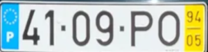
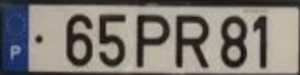

# Introdução

Uma empresa de tecnologia procura o desenvolvimento de um algoritmo que faça a deteção de matrículas de veículos e extraia os seus caracteres, especificamente, de matrículas portuguesas, para gestão de entradas e saídas das instalações da empresa.
O algoritmo deve ser constituído por quatro módulos:

-	**Deteção da matrícula**: módulo responsável pela deteção das matrículas. Neste módulo serão recolhidas imagens de veículos com matrícula portuguesa, com as quais será criado um dataset utilizado para treinar um modelo de deep learning. Depois do treino, os pesos (um ficheiro do tipo .pt, por exemplo, “best.pt”), gerados durante o treino, serão utilizados para efetuar inferências sobre imagens nunca antes vistas. Por fim, guardar as imagens com as anotações feitas durante as inferências e os respetivos ficheiros (do tipo .txt) que contêm as coordenadas das bounding boxes, de forma a ser utilizado no próximo módulo. 

-	**Recorte da imagem com base nas coordenadas da bounding box**: módulo responsável por pelo recorte da área onde foi detetada a matrícula. Com os valores presentes em cada ficheiro, calcular as coordenadas do canto superior esquerdo e o canto inferior direito da bouding box. Por fim, utilizar uma biblioteca que permita processar digitalmente imagens (OpenCV) para efetuar o recorte da área da bounding box e guardar as novas imagens que apenas contêm a matrícula.

-	 **Pipeline de processamento digital de imagem**: módulo responsável por extrair os caracteres presentes nas imagens recortadas, obtidas no módulo anterior. De forma a atingir este objetivo existem várias abordagens que podem ser utilizadas:
o	OCR (Optical Character Recognition) - processo que converte imagens com texto em texto capaz de ser compreendido por computadores.
o	Pipeline de processamento digital de imagem - segmentação e extração dos caracteres utilizando técnicas de processamento de imagem.

-	**Análise de texto e correção de erros**: módulo responsável pela análise do texto extraído, de todas as imagens, e correção de potenciais erros cometidos pela abordagem utilizado no módulo anterior.


# Matrículas portuguesas

| **Matrícula** | **Ano** | **Formato** | **Pares de caracteres** |
|:-------------:|:-------:|:-------------------:|:-----------------------:|
|  | Até 1992 | AA - 11 - 11 | Par 1 - 2 letras <br /> Par 2 - 2 números <br /> Par 3 - 2 números |
|  | 1992 a 2005 | 11 - 11 - AA | Par 1 - 2 números <br /> Par 2 - 2 números <br /> Par 3 - 2 letras |
|  | 2005 a 2020 | 11 - AA - 11 | Par 1 - 2 números <br /> Par 2 - 2 letras <br /> Par 3 - 2 números |
|  | Desde 2020 | AA - 11 - AA | Par 1 - 2 letras <br /> Par 2 - 2 números <br /> Par 3 - 2 letras |


# Diagrama de funcionamento do algoritmo:


# Conteúdo
- [Plataformas](#Plataformas)

- [Recursos](#Recursos)

- [Módulo 1 - Deteção da matrícula](#módulo-1---deteção-da-matrícula)
  - [Construção do dataset](#construção-do-dataset)
  - [Preparação do dataset (Roboflow)](#preparação-do-dataset-(roboflow))
    - [Criar projeto de deteção de objetos](#criar-projeto-de-deteção-de-objetos)
    - [Upload das imagens](#upload-das-imagens)
    - [Anotar as imagens](#anotar-as-imagens)
    - [Distribuição das imagens](#distribuição-das-imagens)
    - [Gerar dataset](#gerar-dataset)
    - [Aplicar aumento de dados (opcional)](#aplicar-aumentações-(opcional))
    - [Efetuar download do dataset no formato desejado](#efetuar-download-do-dataset-no-formato-desejado)
  - [Acesso ao Google Drive](#acesso-ao-google-drive)
  - [Treino do dataset](#treino-do-dataset)
    - [Preparação para o treini](#preparação-para-o-treino)
    - [Dependências do modelo YOLO](#dependências-do-modelo-yolo)
    - [Unzip do dataset](#unzip-do-dataset)
    - [#Exemplos de parâmetros](#exemplos-de-parâmetros)
    - [Treino do modelo](#treino-do-modelo)
    - [Métricas](#Métricas)
    - [Resultados do treino](#resultados-do-treino)
  - [Inferências](#inferências)
    - [Parâmetros das inferências](#parâmetros-das-inferências)
    - [Exemplos de parâmetros](#exemplos-de-parâmetros)
    - [Para efetuar as inferências](#para-efetuar-as-inferências)

- [Módulo 2 - Recorte da imagem com base nas coordenadas da bounding boxes](#módulo-2---Recorte-da-imagem-com-base-nas-coordenadas-da-bounding-boxes)
  - [Organização dos ficheiros com as bounding boxes](#organização-dos-ficheiros-com-as-bounding-boxes)
  - [Aceder ao Google Drive](#aceder-ao-google-drive)
  - [Bibliotecas](#bibliotecas)
  - [Caminhos das diretorias](#caminhos-das-diretorias)
  - [Obter os caminhos das labels](#obter-os-caminhos-das-labels)
  - [Obter os caminhos das imagens](#obter-os-caminhos-das-imagens)
  - [Obter os nomes dos ficheiros das labels](#obter-os-nomes-dos-ficheiros-das-labels)
  - [Obter os nomes dos ficheiros das imagens](#obter-os-nomes-dos-ficheiros-das-imagens)
  - [Efetuar o recorte das imagens](#efetuar-o-recorte-das-imagens)

- [Módulo 3 - Pipeline de processamento digital da imagem](#módulo-3---pipeline-de-processamento-digital-da-imagem)

  - [Abordagem 1 - Utilização de uma biblioteca OCR (Optical Character recognition)](#abordagem-1---Utilização-de-uma-biblioteca-OCR-(optical-Character-recognition))
    - [Aceder ao Google Drive](#aceder-ao-google-drive)
    - [Instalar a biblioteca PaddleOCR](#instalar-a-biblioteca-PaddleOCR)
    - [Bibliotecas](#Bibliotecas)
    - [Carregar modelo OCR](#carregar-modelo-ocr)
    - [Aplicar o OCR sobre as imagens das matrículas recortadas](#aplicar-o-ocr-sobre-as-imagens-das-matrículas-recortadas)
    - [Obter os resultados da aplicação do OCR](#obter-resultados-da-aplicação-do-ocr)
    - [Guardar os resultados](#guardar-os-resultados)
    - [Exemplo de um resultado da aplicação do OCR](#exemplo-de-um-resultado-da-aplicação-do-ocr)

  - [Abordagem 2 - Aplicação do método de Otsu](#abordagem-2---aplicação-do-método-de-otsu)
    - [Aceder ao Google Drive](#aceder-ao-google-drive)
    - [Bibliotecas](#bibliotecas)
    - [Ler as imagens e convertê-las para preto e branco](#ler-as-imagens-e-convertê-las-para-preto-e-branco)
    - [Aplicar o método de Otsu](#aplicar-o-método-de-otsu)
    - [Verificar se a imagem tem mais pixéis pretos do que brancos](#verificar-se-a-imagem-tem-mais-pixéis-pretos-do-que-brancos)
    - [Aplicação de operações morfológicas](#aplicação-de-operações-morfológicas)
    - [Construção de uma máscara com caracteres](#construção-de-uma-máscara-com-caracteres)
      - [Inicializar a máscara](#inicializar-a-máscara)
      - [Análise de componentes](#análise-de-componentes)
      - [Obter os contornos presentes na máscara](#obter-os-contornos-presentes-na-máscara)
      - [Ordenar os contornos da esquerda para a direita](#ordenar-os-contornos-da-esquerda-para-a-direita)
    - [Extrair os caracteres](#extrair-os-caracteres)  
    - [Classificação dos caracteres](#classificar-os-caracteres)
      - [Bibliotecas](#bibliotecas)
      - [Carregar o modelo de classificação](#carregar-o-modelo-de-classificação)
      - [Carregar pesos pré-treinados](#carregar-pesos-pré-treinados)
      - [Classificar os caracteres](#classificar-os-caracteres)
    - [Guardar os resultados](#guardar-os-resultados)

  - [Abordagem 3 - Utilização da biblioteca Grounding Dino (deteção de caracteres) e Segment Anything Model (segmentação de caracteres)](#abordagem-3---utilização-da-biblioteca-grounding-dino-(deteção-de-caracteres)-e-segment-anything-model-(segmentação-de-caracteres))
    - [Aceder ao Google Drive](#aceder-ao-google-drive)
    - [Instalar Grounding Dino](#instalar-grounding-dino)
    - [Instalar Segment Anything Modelo (SAM)](#instalar-segment-anything-model-sam)
    - [Efetuar download dos pesos do Grounding Dino](#efetuar-download-dos-pesos-do-grounding-dino)
    - [Bibliotecas do Grounding Dino](#bibliotecas-do-grounding-dino)
    - [Utilização do modelo Grounding Dino](#utilização-do-modelo-grounding-dino)
      - [Carregar o modelo Grounding Dino](#carregar-o-modelo-grounding-dino)
      - [Parâmetros do Grounding Dino](#parâmetros-do-grounding-dino)
      - [Aplicar o Grounding Dino](#aplicar-o-grounding-dino)
      - [Resultados da deteção](#resultados-da-deteção)
    - [Utilização do SAM](#utilização-do-sam)
      - [Download od checkpoint do SAM](#download-do-checkpoint-do-sam)
      - [Inicializar o modelo SAM](#inicializar-o-modelo-sam)
      - [Aplicar o modelo SAM](#aplicar-o-modelo-sam)
      - [Normalizar as bounding boxes obtidas pelo Grounding Dino](#normalizar-as-bounding-boxes-obtidas-pelo-grounding-dino)
      - [Calcular as máscaras com base nas bounding boxes do Grounding Dino](#calcular-as-máscaras-com-base-nas-bounding-boxes-do-grounding-dino)
      - [Função que transforma os arrays com a informação das máscaras em imagens](#função-que-transforma-os-arrays-com-a-informação-das-máscaras-em-imagens)
    - [Criar uma máscara com todas as máscras](#criar-uma-máscara-com-todas-as-máscaras)
    - [Obter os contornos presentes na máscara](#obter-os-contornos-presentes-na-máscara)
    - [Ordenar os contornos da esquerda para a direita](#ordenar-os-contornos-da-esquerda-para-a-direita)
    - [Extrair os caracteres](#extrair-os-caracteres)
    - [Extrair os caracteres](#extrair-os-caracteres)  
    - [Classificação dos caracteres](#classificar-os-caracteres)
      - [Bibliotecas](#bibliotecas)
      - [Carregar o modelo de classificação](#carregar-o-modelo-de-classificação)
      - [Carregar pesos pré-treinados](#carregar-pesos-pré-treinados)
      - [Classificar os caracteres](#classificar-os-caracteres)
    - [Guardar os resultados](#guardar-os-resultados)
      
- [Módulo 4 - Análise de texto e correção de erros](#módulo-4---Análise-de-texto-e-correção-de-erros)
  - [Erros nos resultados obtidos pelo OCR e classificação de caracteres](#erros-nos-resultados-obtidos-pelo-ocr-e-classificação-de-caracteres)
  - [Correção de erros](#correção-de-erros)
  - [Resultados](#resultados)
  - [Comparar resultados com as matrículas reais](#comparar-resultados-com-as-matrículas-reais)


# Plataformas

| **Recursos** | **Utilização** | **Materiais de apoio** |
|:--------------:|:----------------:|:------------------------:|
| [Google Colab](https://colab.google/) | Desenvolvimento do algoritmo | [Tutorial](https://colab.research.google.com/)
| [Google Drive](https://www.google.com/drive/) | Armazenamento dos datasets e dos notebooks | [Tutorial](https://support.google.com/drive/answer/2424384?hl=en&co=GENIE.Platform=Desktop)
| [Roboflow](https://roboflow.com/) | Preparação de dados | [Tutorial](https://blog.roboflow.com/getting-started-with-roboflow/)


# Recursos 

| **Recursos** | **Utilização** | **Materiais de apoio** | **Repositório/Artigo** |
|:--------------:|:----------------:|:------------------:|:----------------------:|
| [YOLO (You Only Look Once)](https://github.com/ultralytics) | Treino de um modelo de deep learning utilizando o dataset criado | [](https://colab.research.google.com/github/ultralytics/yolov5/blob/master/tutorial.ipynb) | [](https://github.com/ultralytics) |
| [PaddleOCR](https://github.com/PaddlePaddle/PaddleOCR/blob/release/2.7/README_en.md) | Deteção e classificação de texto  (abordagem 1) | [](https://github.com/PaddlePaddle/PaddleOCR/blob/release/2.7/doc/doc_en/quickstart_en.md#22-use-by-code) | [](https://github.com/PaddlePaddle/PaddleOCR/blob/release/2.7/README_en.md) [](https://arxiv.org/abs/2009.09941) |
| [Método de Otsu](https://en.wikipedia.org/wiki/Otsu%27s_method) | Segmentação de imagens (abordagem 2) | [OpenCV](https://docs.opencv.org/3.4/d7/d4d/tutorial_py_thresholding.html) [Algoritmo](https://en.wikipedia.org/wiki/Otsu%27s_method#Python_implementation) |  |
| [Grounding Dino](https://github.com/IDEA-Research/GroundingDINO) | Deteção automática de objetos com base num prompt (abordagem 3) | [](https://colab.research.google.com/github/roboflow-ai/notebooks/blob/main/notebooks/zero-shot-object-detection-with-grounding-dino.ipynb) | [](https://github.com/IDEA-Research/GroundingDINO) [](https://arxiv.org/abs/2303.05499)
| [Segment Anything Model](https://github.com/facebookresearch/segment-anything) | Segmentação automática de objetos (abordagem 3) | [](https://colab.research.google.com/github/roboflow-ai/notebooks/blob/main/notebooks/how-to-segment-anything-with-sam.ipynb) | [](https://github.com/facebookresearch/segment-anything) [](https://arxiv.org/abs/2304.02643) |

# **Módulo 1 - Deteção da matrícula**

## **Construção do dataset**

O dataset deve ser constituído por imagens diurnas (tiradas manualmente, obtidas da Internet, vídeo, etc..) de veículos (carros, carrinhas, camiões, motas...) com matrícula portuguesa frontais e traseiras sem muita angulação (vertical ou horizontal) em que os caracteres das da matrícula sejam bem visíveis. A condição de iluminação das imagens também deve ser variada. Quantas mais imagens melhor, embora o tempo de anotação seja maior (sugestão: 200 a 500 imagens). 

<div align="center">

| **Imagens adequadas para o treino** | **Imagens não adequadas para o treino** | 
|:----:|:----:|
|||
|||
|||
|||


</div>

### **Preparação do dataset (Roboflow)**

Criar uma conta [Roboflow](https://app.roboflow.com/login), caso necessário.


#### **Criar projeto de deteção de objetos**

<div align="center">


</div>


#### **Upload das imagens**

<div align="center">


</div>

#### **Anotar as imagens**

<div align="center">


</div>

#### **Distribuição de imagens**

<div align="center">


</div>

#### **Gerar dataset**

<div align="center">


</div>

#### **Aplicar aumento de dados (opcional)**

O aumento de dados é opcional, uma vez que os resultados do treino podem bons mesmo se as utilizar.
São úteis quando os dados são poucos.

Caso sejam necessárias, as seguintes são as mais pertinentes:

- **Flip** (horizontal)

<div align="center">


</div>

- **Crop** (5 a 15%)

<div align="center">


</div>

- **Rotation** (-15 a 15 graus)

<div align="center">


</div>

- **Brightness** (brighten e darken, -15 a 15%)

<div align="center">


</div>

- **Blur** (1.25 píxeis)

<div align="center">


</div>

- **Noise** (5%)

<div align="center">


</div>

Os valores indicados em cada uma das aumentações podem e devem ser alterados.

#### **Efetuar download do dataset no formato desejado**

Efetuar o download do dataset no formato do modelo a utilizar no treino e colocar no Google Drive. Criar conta no [Google Drive](https://www.google.com/drive/) se necessário.

<div align="center">


</div>

# **No Google Colab**

## **Acesso ao Google Drive**

Permitir que o Google Drive seja acedido pelo Google Colab.

```bash

from google.colab import drive

drive.mount('/content/drive/') # nome da diretoria onde serão colocados os ficheiros do Google Drive -> /nome_da_pasta/MyDrive/

# os conteúdos do Google Drive têm de estar numa diretoria vazia

```
## **Treino do dataset**

YOLOv5 é utilizado como exemplo.


### **Preparação para o treino**

Antes de prosseguir, adicionar o repositório da [YOLOv5](https://github.com/ultralytics).

Relativamente ao dataset exportado do Roboflow:

  1. Descomprimir o dataset;
  2. Abrir o ficheiro "data.yaml";
  3. Alterar os camimhos presentes no ficheiro para:

  train: /content/data/train/images
  val: /content/data/valid/images
  test: /content/data/test/images

  4. Guardar as alterações;
  5. Comprimir o dataset;
  6. Guardar o dataset no Google Drive.

Instalação de dependências do modelo YOLO:

  1. No lado esquerdo, escolher o tab "Ficheiros";
  2. Abrir as pastas onde se encontram o repositório do YOLOv5;
  3. Selecionar a pasta do YOLOv5 com o botão direito do rato;
  4. Escolher a opção "Copiar caminho";
  5. Na célula abaixo, substituir apenas a palavra "caminho" pelo caminho copiado.


### **Dependências do modelo YOLO**

```bash

# entrar na diretoria do YOLO
%cd caminho

!pip install -qr requirements.txt  # instala as dependências listadas no ficheiro (apenas as que ainda não estão instaladas)

```

### **Unzip do dataset**

Obter o caminho da diretoria onde se encontra o dataset:
  1. No lado esquerdo, escolher o tab "Ficheiros";
  2. Abrir as pastas onde se encontra o dataset;
  3. Selecionar a pasta do dataset com o botão direito do rato;
  4. Escolher a opção "Copiar caminho";
  5. Na célula abaixo, substituir apenas a palavra "caminho" pelo caminho copiado.

```bash

# unzip do dataset

# alterar caminho
!unzip caminho -d /content/data/

# -d /content/data/ -> cria uma pasta com nome "data" e coloca o que se encontra no zip na mesma
```
Variáveis que afetam a performance do modelo.

- img -> dimensão do input - as imagens serão ajustadas tendo em conta o valor definido. Quanto maior for a imagem mais detalhe é possível extrair, mas maior será o valor de memória de vídeo utilizado.
- batch -> dados de treino utilizados em cada iteração. O valor escolhido deve ter em conta o tamanho do input. Por norma, quanto maior for o input menor será o valor de cada batch;
- epochs -> número de iterações que o treino vai efetuar;
- data -> diretoria onde se encotra o ficheiro "data.yaml", presente na pasta do dataset:
  - Na pasta "Data", selecionar o ficheiro "data.yaml" com o botão direito;
  - Escolher a opção "Copiar caminho";
  - Na célula abaixo, substituir apenas as palavras "caminho pesos" pelo caminho copiado;
- cfg -> modelo a ser utilizado para efetuar o treino:
  - yolov5n -> n - nano;
  - yolov5s -> s - small;
  - yolov5m -> m - medium;
  - yolov5l -> l - large;
  - yolov5x -> x - extra large;

  A utilização de modelos maiores requerem mais tempo por cada iteração, mas podem permitir a obtenção de melhores resultados.

  Os modelos encontram-se no repositório do YOLOv5:
  - Diretoria "models";
  - Selecionar o modelo pretendido com o botão direito;
  - Escolher a opção "Copiar caminho";
  - Na célula abaixo, substituir apenas as palavras "caminho modelo" pelo caminho copiado;

- weights -> pesos pré-treinados, de um dos modelo mencionados acima. O nome do modelo tem de ser colocado entre aspas. A sua utilização é opcional, mas no contexto do problema pode acelerar o treino.
  - yolov5n.pt
  - yolov5s.pt
  - yolov5m.pt
  - yolov5l.pt
  - yolov5x.pt

- name -> o nome da diretoria onde serão guardados os resultados. Sempre que for efetuado um treino será incrementado um valor ao nome definido. Se o nome definido for "resultados":
  - 1º treino -> resultados
  - 2º treino -> resultados2
  - 3ª treino -> resutlados3

  Os resultados de cada treino encontram-se na diretoria do repositório do YOLOv5:
  - runs/train


```bash

# exemplo de treino que utiliza o modelo yolov5l e os pesos pré-treinados do modelo yolov5l
!python train.py --img 256 --batch 24 --epochs 2 --data  /content/caminho/data.yaml --cfg ./models/yolov5l.yaml --weights yolov5l --name resultados  --cache --exist-ok

```

### **Exemplos de parâmetros**

```bash

img = 256 # dimensão do input - as imagens serão ajustadas tendo em conta o valor definido
batch = 100 # dados de treino utilizados em cada iteração
epochs = 5 # número de iterações
data = caminho # -> ficheiro data.yaml -> ficheiro que contém o caminho para as diferentes diretorias
cfg = caminho modelo # yolov5x, yolov5l, yolov5m, yolov5s -> s - small, m - medium, l -large, x - extra large -> quanto maior for o modelo mais lento será o treino
weights = "yolov5m.pt" # pesos pré-treinados -> opcional, pode acelerar o treino (melhores resultados mais depressa)
name = "resultados" # nome da diretoria onde serão guardados os resultados

```

### **Treino do modelo**

```bash 

# efetuar o treino
!python train.py --img {img} --batch {batch} --epochs {epochs} --data {data} --cfg {cfg} --weights {weights} --name {name}  --cache

# train.py -> script para efetuar o treino que se encontra na diretoria da YOLO

```

### **Métricas**

- **Precision (P)** -> A precisão de previsões positivas. Um valor alto de precisão indica que o modelo não gera previsões consideradas falsos positivos, o que siginifica que as previsões são confiáveis;
- **Recall (R)** -> Também chamada de sensibilidade (sensitivity), mede a proporção de verdadeiros positivos em relação ao total de instâncias positivas. Um valor alto de Recall indica que o modelo consegue identificar corretamente a maior parte das instâncias positivas;
- **mAP** (mean Average Precision)-> A média da precisão tendo em conta todas as classes do dataset;
  - **mAP50** -> A média da precisão de todas as classes tendo em conta um valor de IoU (Intersection over Union - o valor de interseção entre a bounding box anotada e a bounding box gerada pelo modelo) de 0.5;
  - **mAP50-95** -> A média da precisão de todas as classes, no intervalo entre 0.5 e 0.95 de IoU com um incremento, tipicamente, de 0.05.

Em todas as métricas, quanto mais próximo o valor for de 1, melhores os resultados.

----------------------------------------------------------------------------------------------------------

**Atenção**

**Bons resultados no treino não significa que os resultados, quando utilizadas imagens nunca antes vistas pelo modelo, também sejam bons.**


### **Resultados do treino**

Exemplo de resultados de um treino:

```bash

Class     Images  Instances          P          R      mAP50   mAP50-95: 100%|██████████| 7/7 [00:04<00:00,  1.67it/s]
  all        209        223      0.973       0.98      0.993      0.754

```


Resultados do treino:

Os melhores resultados foram obtidos na iteração 414 e o treino parou na iteração 515, uma vez que não existiu uma melhoria dutante 100 iterações (patience pré-definida é 100).

<div align="center">


</div>


Para efetuar de novo a validação, sem o treino:

```bash 

# para validar os resultados do treino é necessário utilizar o script val.py
# basta indicar o caminho para os pesos do treino e o tamanho de input das imagens

!python val.py --data /content/caminho/data.yaml --weights /content/caminho/best.pt --img 640 

# os resultados da validação são guardados na pasta runs/val

```

Exemplo de métricas de validação:

```bash

Class     Images  Instances          P          R      mAP50   mAP50-95: 100%|██████████| 7/7 [00:03<00:00,  2.27it/s]
  all        209        223      0.973       0.98      0.993      0.753

```


Para obter as métricas de teste:

Utilizar o mesmo código utilizado para obter as métricas da validação e adicionar o parâmetro "--task test".

```bash

# basta indicar o caminho para os pesos do treino, o tamanho de input das imagens e indicar --task test

!python val.py --data /content/caminho/data.yaml --weights /content/caminho/best.pt --img 640 --task test

```


Exemplo de métricas de teste:

```bash

Class     Images  Instances          P          R      mAP50   mAP50-95: 100%|██████████| 5/5 [00:02<00:00,  1.80it/s]
  all        157        165      0.979      0.933      0.967      0.751
  
```


## **Inferências**

### **Parâmetros das inferências**

Variáveis que afetam a performance do modelo.

- img -> dimensão do input - as imagens serão ajustadas tendo em conta o valor definido. Quanto maior for a imagem mais detalhe é possível extrair, mas maior será o valor de memória de vídeo utilizado;
- conf -> valor mínimo de confiança de cada deteção. Se o valor for menor que o valor definido, apesar de existirem deteções efetuadas pelo modelo estas não serão colocadas na imagem;
- data -> diretoria onde se encotra o ficheiro "data.yaml", presente na pasta do dataset:
  - Na pasta "Data", selecionar o ficheiro "data.yaml" com o botão direito;
  - Escolher a opção "Copiar caminho";
  - Na célula abaixo, substituir apenas as palavras "caminho pesos" pelo caminho copiado;
- weights -> pesos do treino efetuado. Os pesos encotram-se na diretoria do repositório do YOLOv5:
  - runs/train/resultados/weights, sendo resultados o nome da diretoria do último treino efetuado;
  - Selecionar com o botão direito do rato o ficheiro com o nome "best.pt";
  - Na célula abaixo, substituir as palavras "caminho pesos" pelo caminho copiado.
- images -> o caminho para as imagens que irão ser inferidas. Utilizar as imagens de teste do dataset:
  - Na diretoria "data", selecionar com o botão direito a diretoria "test/images";
  - Escolher a opção "Copiar caminho";
  - Na célula abaixo, substituir a palavra "caminho" pelo caminho copiado;
- inf_name -> o nome da diretoria onde serão guardados os resultados da inferência. Sempre que for efetuado uma inferência será incrementado um valor ao nome definido. Se o nome definido for "resultados_inferencia":

  - 1º treino -> resultados_inferencia
  - 2º treino -> resultados_inferencia2
  - 3ª treino -> resultados_inferencia3

  Os resultados de cada inferência encontram-se na diretoria do repositório do YOLOv5:
  - runs/detect

  Cada diretoria de resutados irá conter uma diretoria chamada "labels" e as imagens utilizadas, que podem ou não estar anotadas.
  A diretoria "labels" irá conter ficheiro do tipo ".txt" com as coordenadas das deteções.

-------------------------------------------------------------------------------
  ## **IMPORTANTE**
  
  ### **Cada imagem será guardada, tenha ou não deteções.**
  
  ### **O ficheiro, para cada imagem, apenas será gerado caso seja feita pelo menos uma deteção.**
-------------------------------------------------------------------------------

- bb_thickness -> espessura das linhas da bounding box;
- hide_labels -> esconde as labels da deteção;

Os dois últimos parâmetros são definidos para diminuir o espaço ocupado por cada bounding box.


### **Exemplos de parâmetros**

```bash

# alterar caminhos do treino se necessário
img = 256 # tamanho da imagem de input
conf = 0.65 # confiança mínima para que seja detetada uma classe
weights = caminho pesos # caminho dos weights do treino -> .../yolov5/yolo-master/runs/train/resultados/weights/best.pt
images = caminho # caminho das imagens -> pode ser uma pasta -> utilizar dados de teste
inf_name = "resultados_inferencia" # pasta onde ficam guardadas as imagens da inferência e os ficheiros txt
bb_thickness = 1 # espessura das linhas da bounding box
hide_labels = True # esconde a label da deteção

```

### **Para efetuar as inferências**

```bash

# efetuar inferênciass
!python detect.py --weights {weights} --img {img} --conf {conf} --source {image} --name {inf_name} --save-txt --line-thickness {bb_thickness} --hide-labels{hide_labels}

# --save-txt -> guarda as anotações efetuadas (ficheiros txt)

# detect.py -> script para efetuar inferências que se encontra na diretoria da YOLO

# os resultados da inferência são guardados no seguinte caminho
# .../yolov5/yolo-master/runs/detect/resultados_inferencia/

```


# **Módulo 2 - Recorte da imagem com base nas coordenadas da bounding boxes**

## **Organização dos ficheiros com as bounding boxes**

Cada ficheiro tem pelo menos uma linha de texto constituído por cinco valores:

- **class** -> classe do objeto detetado, não é relevante para o problema em questão;
- **x** -> valor de x, do centro da bounding box;
- **y** -> valor de y, do centro da bounding box;
- **width** -> largura da bounding box;
- **height** -> altura da bounding box.

<div align="center">


</div>

Exemplo de um ficheiro de inferência:

<div align="center">


</div>


## **Aceder ao Google Drive**

```bash

from google.colab import drive

drive.mount('/content/drive/') # nome da diretoria onde serão colocados os ficheiros do Google Drive -> /nome_da_pasta/MyDrive/

# os conteúdos do Google Drive têm de estar numa diretoria vazia

```

## **Bibliotecas**

```bash

import cv2 # OpenCV, abrir e guardar imagens
import glob # obtém os caminhos todos os ficheiros presentes na diretoria dada, pastas inclusive

```

## **Caminhos das diretorias**

Adicionar o os caminhos ao código abaixo.

```bash

diretoria_labels = "/*.txt"
diretoria_imagens = "/*.jpg" # alterar a extenção com base na extensão das imagens

```

## **Obter os caminhos das labels**

```bash

caminhos_labels = []

for item in sorted(glob.iglob(diretoria_labels)): # sorted ordena os nomes de forma ascendente

  caminhos_labels.append(item)

caminhos_labels

```

## **Obter os caminhos das imagens**

```bash

caminhos_imagens = []

for item in sorted(glob.iglob(diretoria_imagens)): # sorted ordena os nomes de forma ascendente

  caminhos_imagens.append(item)

caminhos_imagens

```

## **Obter os nomes dos ficheiros das labels**

```bash

nomes_labels = []

for item in caminhos_labels:

  split_item = item.split("/")
  nome_item = split_item[-1]
  nome_item = nome_item.replace(".txt", "")

  nomes_labels.append(nome_item)

nomes_labels

```

## **Obter os nomes dos ficheiros das imagens**

```bash

nomes_imagens = []

for item in caminhos_imagens:

  split_item = item.split("/")
  nome_item = split_item[-1]
  nome_item = nome_item.replace(".jpg", "") # alterar ".png" para a extensão das imagens

  nomes_imagens.append(nome_item)

nomes_imagens

```

## **Efetuar o recorte das imagens**

```bash

counter = 0 # atribuir um nome às imagens que serão guardadas

counter_labels = 0 # abrir a label correta

for i in range (0, len(caminhos_imagens)):

  # verificar se a imagem tem uma label, se existir efetua o recorte da imagem com base nas coordenadas
  if nomes_imagens[i] in nomes_labels:

     # ler a imagem
     imagem = cv2.imread(caminhos_imagens[i])

     # largura e altura da imagem
     largura = imagem.shape[1]
     altura = imagem.shape[0]

     # ler os ficheiros

     # abrir o ficheiro
     f = open(caminhos_labels[counter_labels])

     # ler todas as linhas do ficheiro
     linhas = f.readlines()

     # processar todas as linhas do ficheiro
     for linha in linhas:

        # remover parágrafos
        l = linha.replace("\n", "")

        # obter cada valor
        l_split = l.split(" ")

        # coordenadas da bounding box
        coordenadas = [float(l_split[1]), float(l_split[2]), float(l_split[3]), float(l_split[4])]


        # calcular as coordenadas

        # desnormalizar as coordenadas
        des_x = coordenadas[0] * largura
        des_y = coordenadas[1] * altura
        des_width = coordenadas[2] * largura
        des_height = coordenadas[3] * altura

        # espessura da bounding box
        # ajustar com base na espessura utilizada nas inferências
        bb_thickeness = 4 # para remover a bounding box

        # cálculo do ponto superior esquerdo (xmin, ymax) e do ponto inferior direito (xmax, ymin)
        xmin = des_x - des_width + des_width / 2 + bb_thickeness
        xmax = des_x + des_width - des_width / 2 - bb_thickeness
        ymin = des_y - des_height + des_height / 2 + bb_thickeness
        ymax = des_y + des_height - des_height / 2 - bb_thickeness


        # recorte da imagem
        imagem_crop = imagem[int(ymin) : int(ymax), int(xmin) : int(xmax)]

        # redimensionar a imagem
        imagem_crop = cv2.resize(imagem_crop, (300, 75))

        # guardar imagem
        cv2.imwrite("/content/" + str(counter) + ".png", imagem_crop)


        counter = counter + 1

     # fechar o ficheiro
     f.close()

     counter_labels = counter_labels + 1


```


# **Módulo 3 - Pipeline de processamento digital da imagem**

## **Abordagem 1 - Utilização de uma biblioteca OCR (Optical Character recognition)**

### **Aceder ao Google Drive**

```bash

from google.colab import drive

drive.mount('/content/drive/') # nome da diretoria onde serão colocados os ficheiros do Google Drive -> /nome_da_pasta/MyDrive/

# os conteúdos do Google Drive têm de estar numa diretoria vazia

```

### **Instalar a biblioteca PaddleOCR**

```bash

# Instalar PaddleOCR
!pip install paddlepaddle-gpu
!pip install paddleocr
!wget http://archive.ubuntu.com/ubuntu/pool/main/o/openssl/libssl1.1_1.1.0g-2ubuntu4_amd64.deb
!sudo dpkg -i libssl1.1_1.1.0g-2ubuntu4_amd64.deb
!git clone https://github.com/PaddlePaddle/PaddleOCR

```

### **Bibliotecas**

```bash

from paddleocr import PaddleOCR, draw_ocr # paddleOCR
from PIL import Image # abrir imagens

```

### **Carregar modelo OCR**
  
### **Aplicar o OCR sobre as imagens das matrículas recortadas**

### **Obter resultados da aplicação do OCR**

### **Guardar os resultados**

Exemplo de como guardar texto num ficheiro.

```bash 

caminho_ficheiro_resultados = "/content/resultados.txt" # caminho onde será guardado o ficheiro

resultados_f = open(caminho_ficheiro_resultados, "a") # gera o ficheiro caso não exista

# adicionar resultado ao ficheiro dos resultados
resultados_f.write("22XV69" + '\n') # \n adiciona um parágrafo

resultados_f.close() # fechar o ficheiro

```

### **Exemplo de um resultado da aplicação do OCR**

<div align="center">


</div>


## **Abordagem 2 - Aplicação do método de Otsu**

 **Elementos estruturantes**

- Elemento estrututante em forma de Cruz - cv2.getStructuringElement(cv2.MORPH_CROSS, (4, 4))

- Elemento estrututante em forma de Elipse - cv2.getStructuringElement(cv2.MORPH_ELLIPSE, (4, 4))

- Elemento estrututante em forma de Rectângulo - cv2.getStructuringElement(cv2.MORPH_RECT, (4, 4))

- kernel = np.ones((4, 4), np.uint8)


[**Operações morfológicas**](https://docs.opencv.org/4.x/d9/d61/tutorial_py_morphological_ops.html)

- Operação morfológica de Erosão - cv2.erode(imagem, elemento_estruturante, iterations = 1)

- Operação morfológica de Dilatação - cv2.dilate(imagem, elemento_estruturante, iterations = 1)

- Operação morfológica de Abertura - cv2.morphologyEX(imagem, cv2.MORPH_OPEN, elemento_estruturante)

- Operação morfológica de Fecho - cv2.morphologyEX(imagem, cv2.MORPH_CLOSE, elemento_estruturante)

- Operação morfológica de Gradiente Morfológico - cv2.morphologyEX(imagem, cv2.MORPH_GRADIENT, elemento_estruturante)

- Operação morfológica de Top Hat - cv2.morphologyEX(imagem, cv2.MORPH_TOPHAT, elemento_estruturante)

- Operação morfológica de Black Hat - cv2.morphologyEX(imagem, cv2.MORPH_BLACKHAT, elemento_estruturante)


**[Filtros](https://docs.opencv.org/3.4/d4/d13/tutorial_py_filtering.html)**

- Média  -> cv2.blur(imagem, (5, 5))

- Gaussiano -> cv2.GaussianBlur(imagem, (5, 5), 0)

- Mediano -> cv2.medianBlur(imagem, 5)

- Bilateral -> cv2.bilateralFilter(imagem, 9, 75, 75) -> 9 (tamanho do filtro) e os valores 75 definem o impacto do filtro na imagem


**[Método de Otsu](https://docs.opencv.org/3.4/d7/d4d/tutorial_py_thresholding.html)**

- threshold = cv2.threshold(imagem, 0, 255, cv2.THRESH_BINARY + cv2.THRESH_OTSU)[1]

### **Bibliotecas**

```bash

import cv2 # OpenCV
import numpy as np # biblioteca com funções matemáticas
from imutils import contours # para ordenar contornos
from google.colab.patches import cv2_imshow # visualização de imagens
import os

```

### **Ler as imagens e convertê-las para preto e branco**

<div align="center">


</div>

### **Aplicar o método de Otsu**

<div align="center">


</div>

**Nota:** As operações morfológicas podem ser aplicadas antes ou depois de aplicar o método. Neste exemplo será aplicado depois de aplicado o método.

#### **Verificar se a imagem tem mais pixéis pretos do que brancos**

**Nota**: O cálculo dos contornos não funciona se o fundo da imagem for branco.

Exemplo:

- Imagem original:

<div align="center">


</div>


- Imagem binarizada:

<div align="center">


</div>


- Imagem binarizada com os píxeis invertidos:

<div align="center">


</div>


#### **Aplicação de operações morfológicas**

Exemplo de uma operação morfológica.

<div align="center">


</div>

### **Construção de uma máscara com caracteres**

#### **Inicializar a máscara** 

Utilizar a biblioteca numpy, função zeros (np.zeros).

#### **Análise de componentes**

Atribuir uma label a cada componente encontrado.

  1. Definir um valor mínimo e máximo que cada label pode ter, com base no número de pixéis da imagem;
  2. Percorrer cada componente:

    2.1. Gerar uma máscara para cada label;

    2.2. Obter o número de pixéis da máscara gerada;
    
    2.3. Verificar se o valor obtida se encontra dentro do intervalo do mínimo e do máximo definidos, e se se encontrar, adicionar a máscara da label à máscara gerada acima.

#### **Obter os contornos presentes na máscara**

Utilizar a função cv2.findContours()

#### **Ordenar os contornos da esquerda para a direita.**

Utilizar função "contours", da biblioteca "imutils".

### **Extrair os caracteres**

Obter a informação de cada bounding box (cv2.boundingRect(contorno)), gerada pela obtenção dos contornos.

```bash

ep = 3 # padding

crop_num = 0


resized_crop = cv2.resize(crop, (20, 20)) # redimensionar a imagem recortada

# gravar imagem
cv2.imwrite(os.path.join(caminho, f'crop{crop_num}.png'), resized_crop)

```

### **Classificação dos caracteres**

#### **Bibliotecas**

```bash

from tensorflow import keras
from tensorflow.keras import layers
import tensorflow as tf

```

#### **Carregar o modelo de classificação**

```bash

input_shape = (20, 20, 3) # input que o modelo aceita
num_classes = 34 # número de classes
classes = ['0', '1', '2', '3', '4', '5', '6', '7', '8', '9', 'A', 'B', 'C', 'D', 'E',
              'F', 'G', 'H', 'J', 'K', 'L', 'M', 'N', 'P', 'Q', 'R', 'S', 'T',
              'U', 'V', 'W', 'X', 'Y', 'Z'] # nomes das classes -> não existe classe para a letra "O" e a letra "I"

modelo = keras.Sequential(
    [
        layers.Dense(32, input_shape =input_shape),
        layers.Dense(64, activation = 'relu'),
        layers.Flatten(),
        layers.Dense(num_classes, activation = 'softmax'),
    ]
)

```

#### **Carregar pesos pré-treinados**

```bash

caminho_pesos = "/content/best_weights.h5"
modelo.load_weights(caminho_pesos)

```

#### **Classificar os caracteres**

```bash

imagem = cv2.imread('/content/crop0.png')

cv2_imshow(imagem)

imagem = np.expand_dims(imagem, axis = 0) # para garantir que as dimensões são as corretas

previsao = modelo.predict(imagem) # classificação por parte do modelo

classe = classes[np.argmax(previsao)] # classe prevista

print("Classe previsa:", classe)

```

#### **Guardar os resultados**

Exemplo de como guardar texto num ficheiro.

```bash

caminho_ficheiro_resultados = "/content/resultados.txt" # caminho onde será guardado o ficheiro

resultados_f = open(caminho_ficheiro_resultados, "a") # gera o ficheiro caso não exista

# adicionar resultado ao ficheiro dos resultados
resultados_f.write("22XV69" + '\n') # \n adiciona um parágrafo

resultados_f.close() # fechar o ficheiro

``` 

## **Abordagem 3 - Utilização da biblioteca Grounding Dino (deteção de caracteres) e Segment Anything Model (segmentação de caracteres)**


### **Aceder ao Google Drive**

```bash

from google.colab import drive

drive.mount('/content/drive/') # nome da diretoria onde serão colocados os ficheiros do Google Drive -> /nome_da_pasta/MyDrive/

# os conteúdos do Google Drive têm de estar numa diretoria vazia

```

### **Instalar Grounding Dino**

```bash

# clonar o repositório -> isto gera uma diretoria chamada "GroundingDino"
!git clone https://github.com/IDEA-Research/GroundingDINO.git

# entrar na diretoria
%cd /content/GroundingDINO/

# instalar dependências
!pip install -e .

```

### **Instalar Segment Anything Model (SAM)**

```bash

# voltar à diretoria inicial
%cd /content/

# colar o repositório -> isto gera uma diretoria chamada "segment-anything"
!git clone https://github.com/facebookresearch/segment-anything.git

# entrar na diretoria
%cd /content/segment-anything/

# instalar dependências
!pip install -e .

```

### **Efetuar download dos pesos do Grounding Dino**

```bash

%cd /content/

# criar uma nova diretoria
!mkdir grounding_dino_weights

# entrar na nova diretoria
%cd grounding_dino_weights

# efetuar o download dos pesos
!wget -q https://github.com/IDEA-Research/GroundingDINO/releases/download/v0.1.0-alpha/groundingdino_swint_ogc.pth

# voltar à diretoria inicial

%cd /content/

```

### **Importante**

Importante
Depois de instalar os dois repositórios, fazer o seguinte:

Selecionar "Tempo de execução", que fica abaixo do título do notebook;
Selecionar "Reiniciar sessão";
Avançar para as próximas células.

### **Bibliotecas do Grounding Dino**

```bash

from groundingdino.util.inference import load_model, load_image, predict, annotate
from groundingdino.util import box_ops
from PIL import Image # ler imagens

from google.colab.patches import cv2_imshow # visualização de imagens

import locale # evitar erros
locale.getpreferredencoding = lambda: "UTF-8"

```

### **Utilização do modelo Grounding Dino**

#### **Carregar o modelo Grounding Dino**

#### **Parâmetros do Grounding Dino**

O text prompt pode ser constituído por palavras ou frases.

```bash

text_prompt = "" # prompt que vai ser utilizado para efetuar as deteções -> "." indica a procura dos diferentes objetos de forma individual
box_threshold = 0 # número mínimo de similaridade entre as bounding boxes
text_threshold = 0 # número mínimo de similaridade entre as bounding boxes

```

#### **Aplicar o Grounding Dino**

#### **Resultados da deteção**

#### **Imagem original**

```bash

Image.fromarray(imagem_source)

```

#### **Imagem com deteções**

```bash

annotated_frame = annotate(image_source = imagem_source, boxes = boxes, logits = logits, phrases = phrases)

Image.fromarray(annotated_frame)

```

<div align="center">


</div>

### **Utilização do SAM**

#### **Bibliotecas do SAM**

```bash

# Geral
import argparse
import os
import copy
import supervision as sv
from PIL import Image, ImageDraw, ImageFont
import torch
from imutils import contours # para ordenar contornos
import cv2

# segment anything
from segment_anything import build_sam, SamPredictor
import numpy as np

```

#### **Download do checkpoint do SAM**

```bash

# carregar checkpoint do modelo SAM
! wget https://dl.fbaipublicfiles.com/segment_anything/sam_vit_h_4b8939.pth

```

#### **Inicializar o modelo SAM**

#### **Aplicar o modelo SAM**

#### **Normalizar as bounding boxes obtidas pelo Grounding Dino**

```bash

# normalizar as bounding boxes obtidas pelo Grounding Dino
H, W, _ = imagem_source.shape
boxes_xyxy = box_ops.box_cxcywh_to_xyxy(boxes) * torch.Tensor([W, H, W, H])

```

#### **Calcular as máscaras com base nas bounding boxes do Grounding Dino**

```bash

# obter máscaras com base nas bounding boxes
transformed_boxes = sam_predictor.transform.apply_boxes_torch(boxes_xyxy, imagem_source.shape[:2]).to("cuda")

masks, _, _ = sam_predictor.predict_torch(colocar parâmetros)

```

#### **Função que transforma os arrays com a informação das máscaras em imagens**

```bash

# Obter apenas as máscaras (preto e branco)
def mask_image(mask):

    color = np.array([255/255, 255/255, 255/255, 1]) # cor da máscara -> branca

    tensor = torch.Tensor.cpu(mask) # carregar a informação da GPU para a memória

    h, w = mask.shape[-2:] # obter as dimensões da máscara

    mask_image = tensor.reshape(h, w, 1) * color.reshape(1, 1, -1) # criar uma máscara com base no tensor

    mask = Image.fromarray((mask_image.cpu().numpy() * 255).astype(np.uint8)).convert("L") # converter o array para uma imagem

    return mask

```

<div align="center">

  
  
  
  
  
  

</div>

#### **Criar uma máscara com todas as máscaras**

#### **Obter os contornos presentes na máscara**

Utilizar a biblioteca cv2.

#### **Ordenar os contornos da esquerda para a direita**

Utilizar a biblioteca imutils.

### **Extrair os caracteres**

Obter a informação de cada bounding box (cv2.boundingRect(contorno)), gerada pela obtenção dos contornos.

```bash

ep = 3 # padding

crop_num = 0


resized_crop = cv2.resize(crop, (20, 20)) # redimensionar a imagem recortada

# gravar imagem
cv2.imwrite(os.path.join(caminho, f'crop{crop_num}.png'), resized_crop)

```

### **Classificação dos caracteres**

#### **Bibliotecas**

```bash

from tensorflow import keras
from tensorflow.keras import layers
import tensorflow as tf

```

#### **Carregar o modelo de classificação**

```bash

input_shape = (20, 20, 3) # input que o modelo aceita
num_classes = 34 # número de classes
classes = ['0', '1', '2', '3', '4', '5', '6', '7', '8', '9', 'A', 'B', 'C', 'D', 'E',
              'F', 'G', 'H', 'J', 'K', 'L', 'M', 'N', 'P', 'Q', 'R', 'S', 'T',
              'U', 'V', 'W', 'X', 'Y', 'Z'] # nomes das classes -> não existe classe para a letra "O" e a letra "I"

modelo = keras.Sequential(
    [
        layers.Dense(32, input_shape =input_shape),
        layers.Dense(64, activation = 'relu'),
        layers.Flatten(),
        layers.Dense(num_classes, activation = 'softmax'),
    ]
)

```

#### **Carregar pesos pré-treinados**

```bash

caminho_pesos = "/content/best_weights.h5"
modelo.load_weights(caminho_pesos)

```

#### **Classificar os caracteres**

```bash

imagem = cv2.imread('/content/crop0.png')

cv2_imshow(imagem)

imagem = np.expand_dims(imagem, axis = 0) # para garantir que as dimensões são as corretas

previsao = modelo.predict(imagem) # classificação por parte do modelo

classe = classes[np.argmax(previsao)] # classe prevista

print("Classe previsa:", classe)

```

#### **Guardar os resultados**

Exemplo de como guardar texto num ficheiro.

```bash

caminho_ficheiro_resultados = "/content/resultados.txt" # caminho onde será guardado o ficheiro

resultados_f = open(caminho_ficheiro_resultados, "a") # gera o ficheiro caso não exista

# adicionar resultado ao ficheiro dos resultados
resultados_f.write("22XV69" + '\n') # \n adiciona um parágrafo

resultados_f.close() # fechar o ficheiro

``` 


# **Módulo 4 - Análise de texto e correção de erros**

### **Erros nos resultados obtidos pelo OCR e classificação de caracteres**

Verificar que erros existem nos resultados cometidos pelo OCR ou classificação de caracteres:

- O resultado tem apenas seis caracteres?
- Existem caracteres que não sejam letras ou números?
- Existem caracteres que têm um número e uma letra?
- Os pares de caracteres do resultado estão de acordo com a matrícula real? Se não, o que falhou?

**Nota**: é importante, quando existem pares com uma letra e um número, substituir o número "0" e o número "1" pela letra "O" e a letra "I", respetivamente.

### **Correção de erros**

Para remover ou substituir caracteres:

```bash

exemplo_string = "A1 11.11"

exemplo_string = exemplo_string.replace(' ', '') # remover o espaço

exemplo_string = exemplo_string.replace('.', '') # remover ponto final

```


### **Resultados**

O resultado de cada matrícula deve ser uma string com seis caracteres (letras e números), sem espaços.

Exemplo:

```bash

exemplo_resultado = "AI1111"

```

### **Comparar resultados com as matrículas reais**